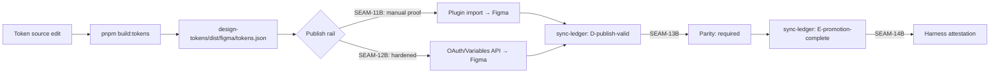
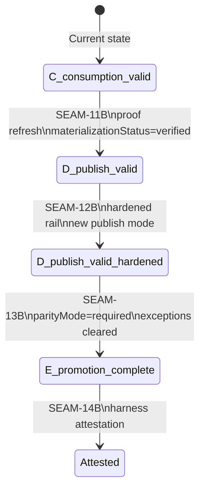
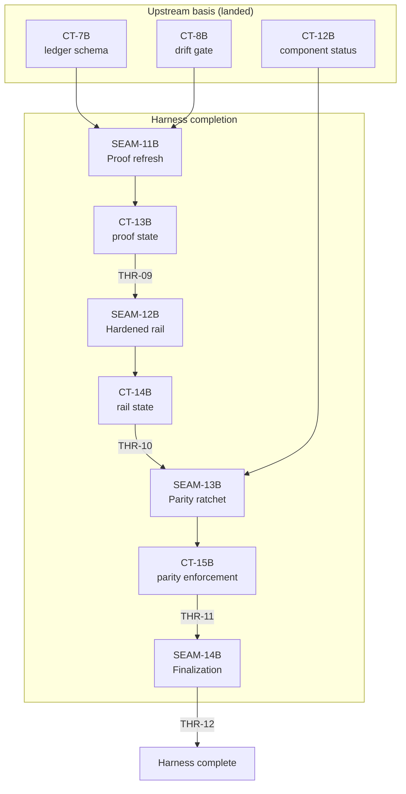
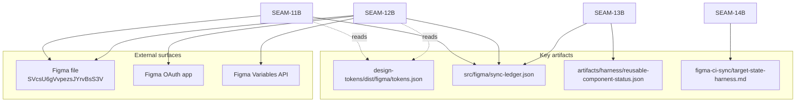

# Review Surfaces — Harness Completion

These diagrams orient the pack. They show the actual product/work shape that is expected to land.
They do not, by themselves, satisfy seam-local pre-exec review.
Active and next seams (SEAM-11B, SEAM-12B) still require seam-local `review.md` as the authoritative pre-exec review artifact before execution begins.

## R1 — Figma publish workflow progression

## R2 — Data flow through sync-ledger state transitions

## R3 — Contract and thread flow

## R4 — Touch surface map

