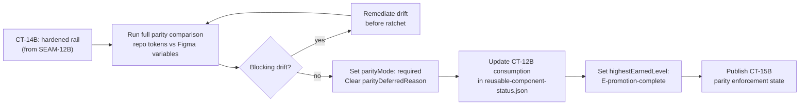
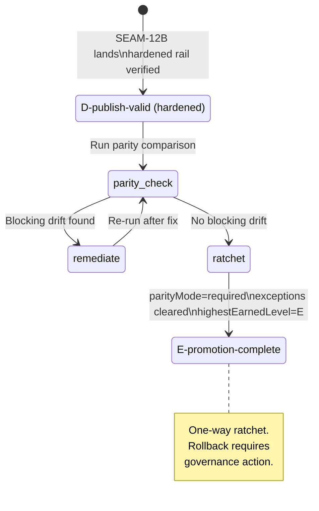
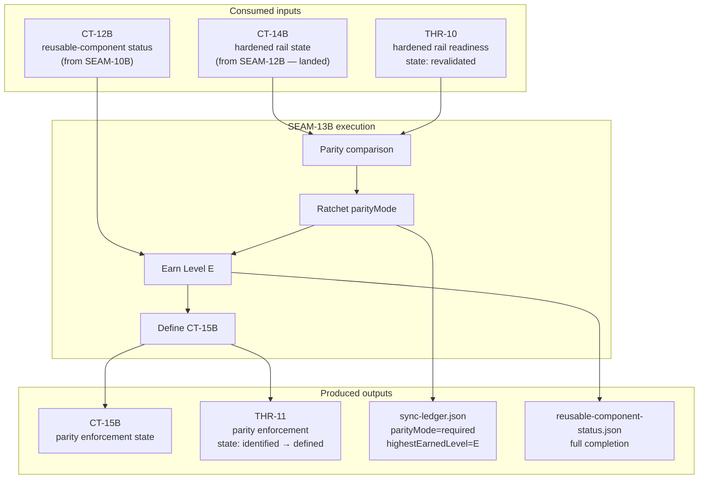

# Review Bundle - SEAM-13B Required Parity Ratchet and Promotion

This artifact feeds `gates.pre_exec.review`.
`../../review_surfaces.md` is pack orientation only.

## Falsification questions

1. **Can parity be ratcheted to required while the hardened rail is absent or broken?** SEAM-12B has now landed. CT-14B is published with all 5 satisfaction criteria met — plugin rail executed at revision `2ee89e27306a1caa846d904ad6229370f371b1b3`, 40 variables materialized, materialization confirmed. The rail is real. This question is resolved for the ratchet precondition; it now shifts to: does the parity comparison show clean alignment before flipping the switch? The one-way ratchet nature remains — the S2 parity comparison must complete cleanly before T2 executes.

2. **Can `highestEarnedLevel: E-promotion-complete` be set while blocking exceptions still exist in sync-ledger.json?** SEAM-12B closeout confirms "sync-ledger.json has no blocking exceptions" at SEAM-12B landing. However, parity was still `deferred` at that point. This question is still live: when S2 runs the full parity comparison, any blocking drift discovered must be remediated before Level E can be set. The Level E claim is still conditional on a clean parity comparison at execution time.

3. **Is CT-12B (reusable-component status) current enough to consume, or could SEAM-10B's landed state have drifted?** CT-12B was published by SEAM-10B in the `harness-future-rails` pack. SEAM-11B and SEAM-12B worked on sync-ledger and the plugin, not on `artifacts/harness/reusable-component-status.json`. The SEAM-12B closeout does not mention modifying this file. CT-12B remains the authoritative source; S2 should verify the file has not been modified before consuming.

## R1 — Parity ratchet workflow

## R2 — Data flow through ledger state transitions

## R3 — Contract and thread flow for SEAM-13B

## Likely mismatch hotspots

- **Parity comparison revealing hidden drift**: SEAM-12B's plugin rail wrote 40 variables into `Collider Tokens / Base` at revision `2ee89e27306a1caa846d904ad6229370f371b1b3`. The parity comparison in S2.T1 must cover all token categories and confirm alignment. The OAuth/Variables API rail is blocked — comparison will use the figma-use CLI approach, which is the planned fallback. Any drift discovered must be remediated before the ratchet executes.
- **CT-12B staleness**: `reusable-component-status.json` was published by SEAM-10B (harness-future-rails). SEAM-11B and SEAM-12B did not touch this file (confirmed by closeouts). S2 should explicitly verify the file is unchanged before consumption.
- **Enforcement wiring gap**: Still present as an execution concern. S2.T3 must either find existing `parityMode` readers in governance scripts or CI, or scope the minimum viable check. No evidence of pre-existing enforcement from SEAM-12B closeout. This is an F3-level execution detail, not a gate blocker — S2.T3 is scoped to address it.

## Pre-exec findings

- **F1 — Basis is provisional** (v1): ~~SEAM-12B has not landed.~~ **RESOLVED at v2**: SEAM-12B landed 2026-03-22 with all 5 CT-14B satisfaction criteria met. CT-14B published. THR-10 revalidated. Basis is now `current`.
- **F2 — Parity comparison procedure is undefined** (v1): **RESOLVED at v2**: SEAM-12B shipped the plugin-import-manual rail as the canonical v1 path (OAuth rail remains blocked as expected). S2.T1 will use the figma-use CLI comparison approach — this was the plan's explicit fallback and is sufficient. The comparison surface is the same Variables API collection that the plugin wrote into (`Collider Tokens / Base`).
- **F3 — Enforcement wiring scope is ambiguous**: Still open as an execution-time concern. SEAM-12B closeout does not mention existing `parityMode` readers. S2.T3 must investigate and either wire or create a minimal enforcement check. Scope remains bounded to S2.T3 — this does not block pre-exec gates.

No remediations are opened. F1 and F2 are resolved by SEAM-12B landing. F3 is an execution-time implementation detail within S2.T3 scope.

## Pre-exec gate disposition

- **Review gate**: **passed** (v2, 2026-03-22) — review bundle refreshed against SEAM-12B landed reality. All three falsification questions evaluated against CT-14B published state. F1 resolved, F2 resolved, F3 bounded to S2.T3 execution scope. Review is sufficient for exec-ready authorization.
- **Contract gate**: **passed** (v2, 2026-03-22) — CT-15B ownership and consumption align with threading.md (owner: SEAM-13B, consumer: SEAM-14B). CT-14B and CT-12B consumption directions are correct. S1 contract definition shape remains valid — CT-14B satisfaction criteria (5-criterion, plugin-import-manual canonical) are now known and S1 satisfaction criteria map cleanly.
- **Revalidation gate**: **passed** (v2, 2026-03-22) — SEAM-12B landed as planned. Stale trigger `seam_12b_hardened_rail_state_change` fired in confirming direction: plugin rail verified, CT-14B published, 5/5 criteria met. Plan remains valid. S2.T1 comparison procedure updated (figma-use fallback confirmed as the path). `basis.currentness` updated to `current`.
- **Opened remediations**: none

## Planned seam-exit gate focus

- **What must be true before downstream promotion is legal**: `parityMode: required` with no `parityDeferredReason` in sync-ledger.json, `highestEarnedLevel: E-promotion-complete`, empty or non-blocking `exceptions` array, `reusable-component-status.json` reflecting full completion, CT-15B published with explicit satisfaction criteria.
- **Which outbound contracts/threads matter most**: CT-15B (SEAM-14B's primary input for attestation), THR-11 (carries Level E reality to SEAM-14B)
- **Which review-surface deltas would force downstream revalidation**: R3 state machine reaching Level E terminal state changes the attestation surface SEAM-14B will reconcile against. Any exceptions remaining in sync-ledger.json at closeout would force SEAM-14B to account for them.
