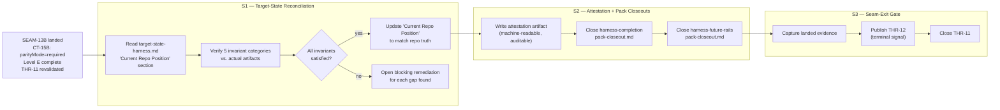

# Pre-exec Review — SEAM-14B Harness Target-State Finalization

## Work shape

SEAM-14B is a documentation and attestation seam. It produces no runtime changes. The work is:

1. Reconcile `figma-ci-sync/target-state-harness.md` "Current Repo Position Versus Target State" section against actual repo artifacts (S1)
2. Produce a machine-readable harness attestation artifact with independently auditable claims (S2)
3. Complete both pack closeouts (`harness-completion` and `harness-future-rails`) (S2)
4. Emit the terminal seam-exit gate record and publish THR-12 (S3)

## Product-facing flow

## Invariant categories (from target-state-harness.md verification)

The seam must address each of the five invariant categories individually:

| Category         | What it means                                                             | Evidence expected                                                                                      |
| ---------------- | ------------------------------------------------------------------------- | ------------------------------------------------------------------------------------------------------ |
| canonical-source | Repo is the canonical source of truth for all design tokens               | Design token source files exist; no Figma-side overrides                                               |
| projection       | Token projection from source to Figma-importable format is deterministic  | `design-tokens/dist/figma/tokens.json` is current at a known revision                                  |
| publish-rail     | A repo-owned rail can write tokens into Figma deterministically           | Plugin rail verified at revision `2ee89e27306a1caa846d904ad6229370f371b1b3`; SEAM-12B CT-14B published |
| verification     | Publish proof is recorded in the sync-ledger at a known artifact revision | `sync-ledger.json` `materializationStatus: verified` + `lastVerifiedRevision`                          |
| promotion        | Level E is earned and parity is required                                  | `parityMode: required`, `highestEarnedLevel: E-promotion-complete`, `exceptions: []` per CT-15B        |

## Falsification questions

1. **Can a reviewer inspect each attestation claim independently?**
   If yes, the seam is done. If any claim is narrative-only with no artifact reference, the attestation is invalid.

2. **Is the "Current Repo Position" section in target-state-harness.md structurally updated or only prose-appended?**
   If the section is only prose-annotated, a future agent may not be able to diff it programmatically. S1 must determine the section's update model and apply it consistently.

3. **Does the harness-future-rails pack-closeout.md have open blocking remediations?**
   If it does, S2 cannot mark it closed. S2 must inspect the file and open a remediation here if any blocker is found.

4. **Are all CT-15B criteria still satisfied at the time S1 runs?**
   If `seam_13b_parity_enforcement_change` or `target_state_harness_document_change` fires between now and S1 execution, THR-11 is stale and the basis must be re-evaluated before attestation.

5. **Is the attestation artifact location meaningful to consumers?**
   The seam brief marks location as TBD. S1 must resolve this to a canonical path (e.g., `artifacts/harness/attestation.json`) so S2 can write it. A path inside `artifacts/harness/` is consistent with CT-13B, CT-14B, and CT-15B conventions.

## Mismatch hotspots

### Hotspot 1 — Attestation artifact location is TBD

The seam brief says "location TBD at seam-local review." This is the highest-priority pre-execution decision. S1 must resolve the location before S2 writes the artifact. Recommended: `artifacts/harness/harness-attestation.json` following the `artifacts/harness/` pattern established by CT-13B through CT-15B.

### Hotspot 2 — harness-future-rails pack-closeout.md state is unknown

SEAM-14B is responsible for closing the harness-future-rails pack closeout. The current state of that document is not tracked in this pack's control plane. S2 must read it before asserting it can be marked complete.

### Hotspot 3 — target-state-harness.md "Current Repo Position" section update model

The section may be free-form prose or a structured table. If it is structured, S1 can update it column-by-column. If prose, S1 must rewrite it. The chosen update approach must be documented in S1's completion checklist so S3's closeout evidence is unambiguous.

### Hotspot 4 — Optional rails must be explicitly documented as optional

CT-15B and the seam brief both note that Chromatic, Storybook Connect, and Code Connect remain optional. The reconciled target-state-harness.md and the attestation artifact must explicitly state these are optional, not silently absent. S1 must verify this is already stated or add it.

## Contract gate disposition

- **CT-15B** (consumed): owned by SEAM-13B, consumed by SEAM-14B via THR-11. CT-15B published at `artifacts/harness/ct-15b-parity-enforcement-state.md`. Consumption is direct — SEAM-14B reads parity enforcement state to anchor the attestation. Contract ownership is authoritative in `threading.md`. ✓ passed
- **THR-12** (produced): terminal thread owned by SEAM-14B. No new contracts produced. THR-12 is a completion signal only — no downstream consumers. ✓ passed

## Revalidation gate disposition

Revalidation completed 2026-03-22 at horizon promotion. Findings:

- **THR-11** (`revalidated`): SEAM-13B landed with CT-15B fully satisfied. `parityMode: required`, `highestEarnedLevel: E-promotion-complete`, `exceptions: []`. The one-way ratchet did not regress. All 5 CT-15B criteria confirmed current.
- **Stale trigger `seam_13b_parity_enforcement_change`**: Not fired. Parity enforcement rules unchanged since SEAM-13B landing.
- **Stale trigger `target_state_harness_document_change`**: Not fired. `figma-ci-sync/target-state-harness.md` unchanged since seam brief was written.
- **Seam plan validity**: SEAM-14B's scope (reconcile doc, produce attestation, close packs) is still the correct and complete set of work. No drift from seam brief. ✓ passed

## Pre-exec gate disposition

| Gate         | Result | Rationale                                                                                                                    |
| ------------ | ------ | ---------------------------------------------------------------------------------------------------------------------------- |
| Review       | passed | Work shape is well-defined and falsifiable. Each deliverable has an independent verifiable artifact.                         |
| Contract     | passed | CT-15B ownership and consumption match threading.md. THR-12 is terminal with no downstream consumers. No invented contracts. |
| Revalidation | passed | THR-11 revalidated. No stale triggers fired. Seam plan unchanged from brief.                                                 |

## Planned seam-exit focus

- **THR-11**: advances from `revalidated` → `closed` at SEAM-14B landing (fully discharged)
- **THR-12**: advances from `identified` → published → closed at SEAM-14B landing
- **Downstream stale triggers**: none (terminal seam)
- **Review-surface areas most likely to shift**: invariant category evidence (if any gap is found in S1), attestation artifact schema
- **Closeout evidence required**: S1 diff of target-state-harness.md, S2 attestation artifact path + schema validation pass, both pack closeouts confirmed complete with no unresolved remediations
