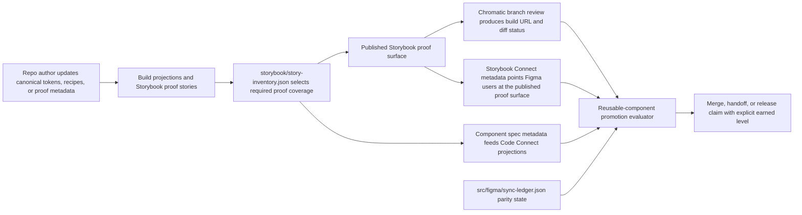
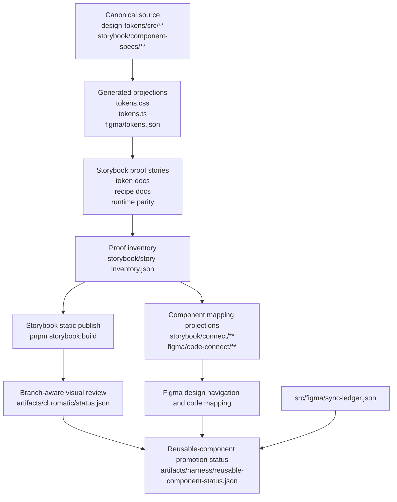
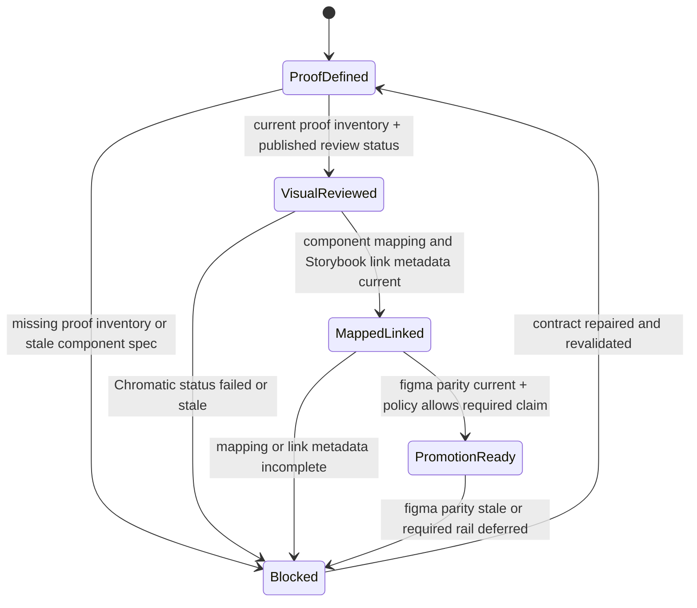
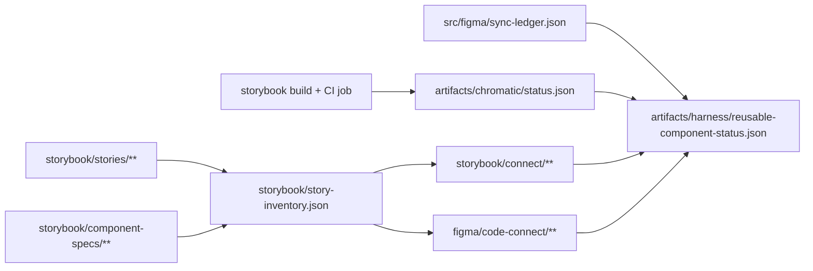

# Review Surfaces - Harness Future Rails

These diagrams are for rapid human review. They show the actual product and system shape that should land if the future harness rails are implemented as planned. The pack topology is implicit in the flow; these are not only planning diagrams.

## R1 — Reusable component review workflow

## R2 — Proof, review, and mapping surface flow

## R3 — Promotion state transitions for reusable components

## R4 — Touch surface map

