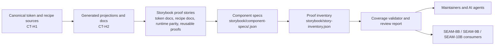
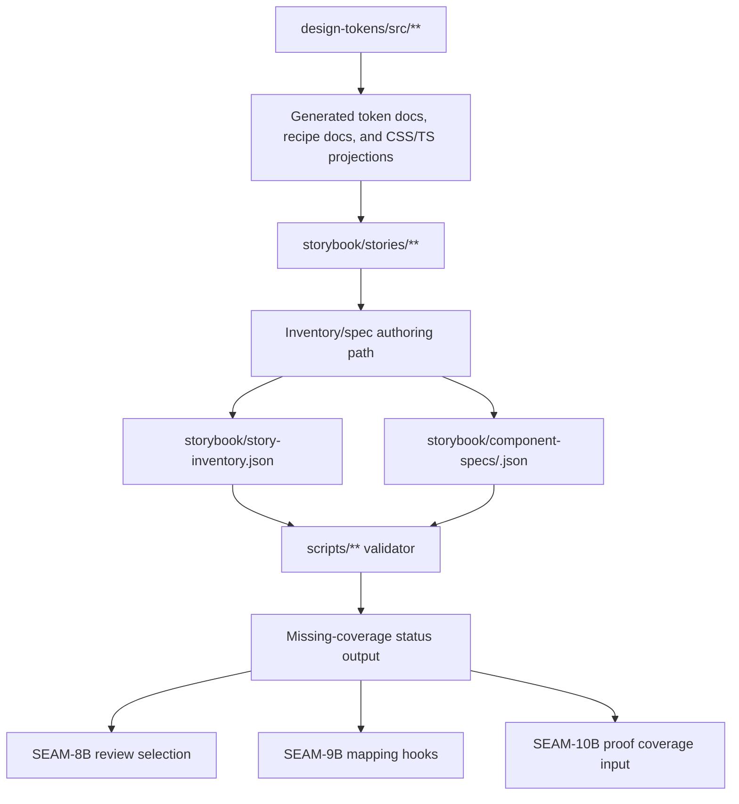
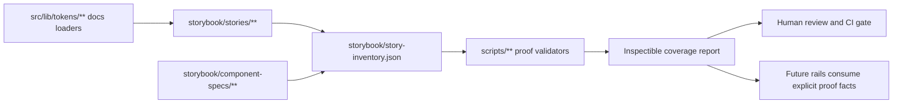
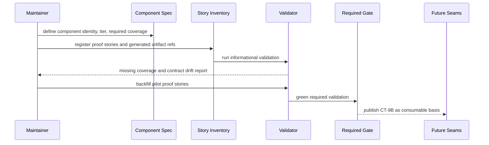

# Review Bundle — SEAM-7B Storybook Proof System Convergence

## Falsification Questions

- Can a reusable component still appear "covered" when it lacks a component spec or when its proof stories exist only as ad hoc stories outside `storybook/story-inventory.json`?
- Is any proof metadata field in the proposed contract trying to restate token values, recipe truth, or Figma parity state that should remain owned by `CT-H1`, `CT-H2`, or `CT-8B`?
- Could `SEAM-8B`, `SEAM-9B`, or `SEAM-10B` start consuming proof coverage before the validator can identify missing required story kinds for a concrete pilot component family?

## R1 — Proof Contract Authoring And Review Flow

## R2 — Proof Metadata And Validator Data Flow

## R3 — Touch-Surface Handoff Map

## R4 — Sequence For Informational-To-Required Gating

## Likely Mismatch Hotspots

- The pilot component family may already have stories whose IDs or locations drift from the current `THR-01` Storybook basis, which would make the first inventory backfill noisy.
- Component-tier policy can easily overreach if it mixes "nice to have" stories with truly required coverage; the first matrix should stay minimal and tied to actual downstream consumers.
- Downstream mapping hooks can become vendor-shaped too early; `SEAM-7B` should publish repo-owned identity and reserved hooks, not Storybook Connect or Code Connect projections.

## Reviewer Checklist

- The diagrams reflect the actual proof-authoring and validation work that would land, not only the pack topology.
- Contract ownership stays aligned with `threading.md`: `SEAM-7B` owns `CT-9B`, while `CT-H1`, `CT-H2`, and `CT-8B` remain upstream inputs.
- The gating sequence prevents downstream seams from consuming proof coverage before the validator can prove it against a real pilot family.
