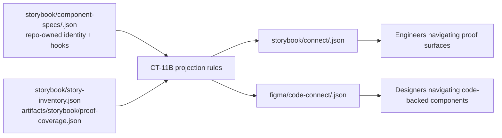
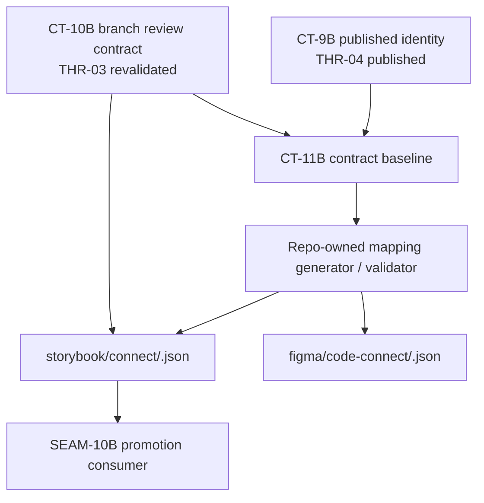
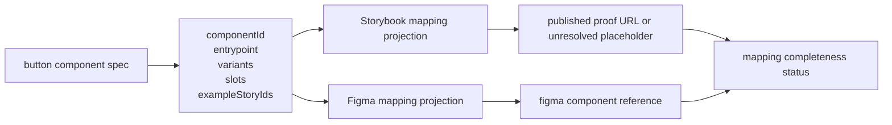

# Review Bundle - SEAM-9B Reusable Component Mapping and Link Convergence

This artifact feeds `gates.pre_exec.review`.
`../../review_surfaces.md` is pack orientation only.

## Falsification Questions

- Can the proposed mapping schema still let vendor-generated IDs, Figma metadata, or Chromatic URLs redefine component identity instead of projecting from `CT-9B`?
- Could a component appear fully mapped even when `codeEntrypoint`, `figmaComponentRef`, or published Storybook link data is missing or only locally inferred?
- If the published `CT-10B` contract later changes its URL shape or review-mode rule, would this seam silently bake stale Storybook link semantics into `CT-11B`?

## R1 - Repo-Owned Mapping Projection Flow

## R2 - Storybook Link Resolution And Published Handoff

## R3 - Pilot Component Mapping Surface

## Likely Mismatch Hotspots

- `storybook/component-specs/button.json` now carries repo-owned `codeEntrypoint` and `figmaComponentRef` values, so the remaining live ambiguity is not source metadata ownership but whether the `CT-10B` Storybook-link fields can be populated from current repo-owned publication evidence.
- `THR-03` is now revalidated, so any field that promises a current Storybook URL must stay tied to the repo-owned `CT-10B` field boundary instead of host conventions, vendor UI links, or prose summaries.
- Storybook and Figma projections can drift if they each acquire separate normalization logic instead of sharing one repo-owned identity transform.
- The temptation to reuse vendor terminology directly in `CT-11B` can make downstream promotion parse tool-specific payloads instead of a stable repo-owned shape.

## Pre-Exec Findings

- The current basis is coherent and falsifiable: `storybook/component-specs/button.json`, `storybook/story-inventory.json`, `artifacts/storybook/proof-coverage.json`, `storybook/chromatic-review-contract.md`, `storybook/chromatic-review-policy.md`, and `harness-future-rails/governance/seam-8b-closeout.md` expose the identity and link-consumption boundary this seam needs.
- `THR-03` and `THR-04` are both revalidated for this seam. The remaining gap is closeout consumability, not handoff ambiguity: `CT-11B` surfaces are landed, but `THR-07` cannot publish until current repo-owned `CT-10B` evidence is available for the live pilot mapping outputs.
- `storybook/component-specs/button.json` already carries the pilot metadata the mapping seam needs at the repo-owned source, so the remaining blocker is the unresolved `CT-10B`-derived Storybook-link fields rather than missing component-spec ownership.
- The current repo reality matches the documented post-exec blocker posture: `artifacts/chromatic/status.json` is absent, `storybook/connect/button.json` and `figma/code-connect/button.json` keep the `CT-10B`-derived Storybook-link fields `null`, and `artifacts/harness/reusable-component-mapping-status.json` still classifies the pilot mapping as incomplete rather than invalid.
- `REM-003` remains open as the seam-owned post-exec blocker for closeout and `THR-07` publication; it does not block pre-exec readiness because contract ownership, review posture, and upstream revalidation are all explicit.

## Pre-Exec Gate Disposition

- **Review gate**: passed. The refreshed falsification questions, product-facing diagrams, and mismatch hotspots still let a reviewer disprove the planned mapping flow before execution proceeds.
- **Contract gate**: passed. Ownership stays aligned with `threading.md`: `SEAM-9B` owns `CT-11B`, consumes `CT-9B` and `CT-10B`, and keeps `THR-07` as the only unpublished outbound thread.
- **Revalidation gate**: passed. `SEAM-8B` landed `CT-10B`, recorded a ready seam-exit handoff in `../../governance/seam-8b-closeout.md`, and the current repo surfaces still match the allowed consumption boundary.
- **Opened remediations**: none from this pre-exec review. `REM-003` stays open as the active seam's landing and closeout obligation.

## Planned Seam-Exit Gate Focus

- **What must be true before downstream promotion is legal**: `CT-11B` is published in repo-owned projection surfaces, required mapping fields are explicit, and Storybook link fields are either backed by published `CT-10B` reality or explicitly marked unavailable.
- **Which outbound contracts/threads matter most**: `CT-11B` and `THR-07`
- **Which review-surface deltas would force downstream revalidation**: any change to component identity shape, Figma reference conventions, Storybook URL resolution logic, or nullable-versus-required completeness rules.
- **Current post-exec blocker posture**: closeout stays blocked until repo-owned `CT-10B` evidence is restored or equivalently recorded so the live pilot mapping can populate the required Storybook-link fields and publish `THR-07`.
