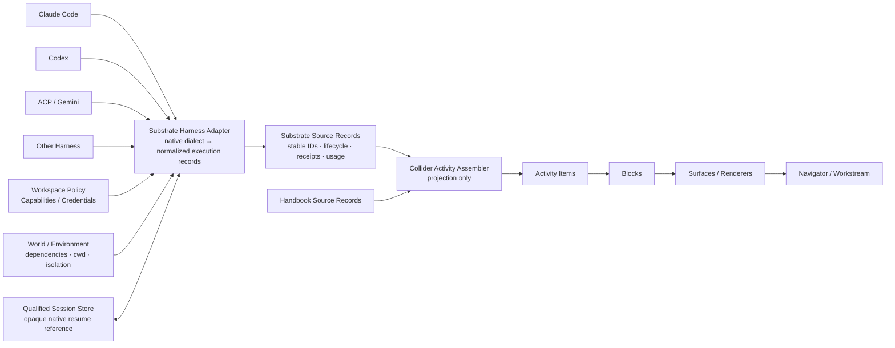

# Agent-Native Architectural Evaluation for Collider and Substrate

## Executive summary

I evaluated BuilderIO’s Agent-Native repository, current documentation, public website, and DeepWiki index, with the source review pinned to **`92e6aec8b26b68e870384009af2a4d40cc68e41d`**, which was the `main` HEAD returned during this research on **September 16, 2026 at 00:17:41 UTC**. The repository is moving quickly enough that pinning matters: GitHub reported another push on September 16, and DeepWiki’s visible index substantially lagged the repository. fileciteturn33file0L1-L2 fileciteturn32file0L1-L10

My overall conclusion is:

> **Agent-Native is probably the closest public implementation reference we have yet found for the _shape_ of Substrate’s Harness abstraction, Qualified Session continuity, workspace-level agent profiles/resources, agent-authored sandboxed UI, and agent/runtime adaptation.**
>
> **It should not become Collider/Substrate’s runtime wholesale.**
>
> The best path is to **reimplement the narrow architectural contracts in Substrate**, use Agent-Native as a conformance/reference implementation, and optionally adapt or vendor particular MIT-cleared pieces later once its repository licensing is cleaned up.

That puts the reference set into a clearer division of labor:

| Reference | Strongest architectural lesson for us | Recommendation |
|---|---|---|
| **DeepSeek/Cordis reference** | Dynamic composition, scoped capabilities, lifecycle-owned effects, host-declared extension locations | Keep as the primary composition/lifecycle reference. |
| **BB** | Provider bridges, normalized activity/timeline construction, replay/recovery, extension lifecycle and fallback | Keep as the stronger Activity Assembly/reconstruction reference. |
| **Agent-Native** | **Harness contract, native Session continuation, profiles/resources, sandbox-provider seam, actions shared between agents/UI, agent-authored sandboxed mini-apps** | **Promote to a first-class Harness/Substrate reference.** |
| **Collider/Substrate** | Authority split, Workspace/Lane model, Handbook Resolution, Surfaces/Blocks, Activity Projection, customizable Navigator, security boundaries | Remains authoritative; do not bend its ontology around Agent-Native. |

The most directly useful piece is [`AgentHarnessAdapter`](https://github.com/BuilderIO/agent-native/blob/92e6aec8b26b68e870384009af2a4d40cc68e41d/packages/core/src/agent/harness/types.ts). It declares harness capabilities, creates a session, accepts Workspace-like execution inputs including `cwd`, instructions, skills, tools, permission mode, sandbox, and opaque `resumeState`, and returns a session with `streamTurn`, optional continuation/approval, detach, stop, and destroy operations. Its event vocabulary already covers text, thinking, activity, tools, approvals, file changes, compaction, usage, errors, completion, and MCP App payloads. fileciteturn38file0L1-L7

Agent-Native’s own documentation makes exactly the distinction we have been converging on: Claude Code, Codex, Pi, ACP agents, and similar systems are **full agent runtimes that own their own loops**, not interchangeable one-model-call providers. Agent-Native therefore drives them as stateful sessions rather than putting them under its `AgentEngine`. It persists their native `resumeState` opaquely rather than interpreting it or replaying the complete chat history into the harness every turn. That strongly validates our separation:

```text
Harness
    execution runtime / adapter

Agent Profile
    reusable behavioral and execution configuration

Qualified Session
    native provider/runtime continuity resource

Lane / World
    execution placement and realized environment

Workstream
    user-visible interaction and activity projection
```

There are, however, three reasons I would **not directly embed Agent-Native as the Substrate engine**.

First, Agent-Native is an entire opinionated application framework. Its Core owns actions, PostgreSQL/PGlite persistence, auth, application state, routing, agent execution, and live sync; Toolkit and Templates build on that foundation. Its product model assumes that agents and React applications operate over a shared SQL-backed application substrate. That would overlap with responsibilities already assigned to Substrate, Handbook, and Collider. Second, its current harness-to-chat normalization is **too lossy for Collider’s intended Activity architecture**. `AgentHarnessEvent` contains tool IDs, usage, file-change structure, compaction, and explicit completion, but the downstream translator reduces or discards portions of that information. Its background transcript then further summarizes `AgentChatEvent` values. We should adapt at the richer native/normalized event boundary rather than make its chat transcript our Source Record. fileciteturn38file0L1-L7 fileciteturn42file0L1-L7

Third, important security assumptions differ. Most notably, Agent-Native’s ACP mode intentionally launches a **local unsandboxed subprocess that inherits the parent environment**, so it can reuse existing Gemini/Claude CLI login state. Agent-Native explicitly says this ACP transport is not hosted or sandboxed. Its separate `run-code` sandbox is substantially more constrained, but those are different execution paths. ### Bottom-line evaluation

| Question | Assessment |
|---|---|
| Is the repository cleanly verifiable as repository-wide MIT? | **No. Intended MIT, but licensing metadata is inconsistent and a root full-text license is absent. Legal clarification recommended before copying/forking.** |
| Is the architecture relevant? | **Extremely. Particularly the Harness/Session/Profile/Sandbox seams.** |
| Is `AgentHarnessAdapter` close to our desired Harness? | **Yes — unusually close conceptually.** |
| Is its Activity model sufficient for Collider? | **No. Useful input, but we need richer stable Source Records and a separate Activity Assembler.** |
| Are its agent-authored Extensions interesting for Collider? | **Yes. They strongly support our agent-generated Surface direction, with important security caveats.** |
| Direct drop-in? | **No. High architectural collision.** |
| Fork the framework? | **No. High maintenance and authority-model cost, plus licensing ambiguity.** |
| Build an adapter around its harness package? | **Viable prototype; Medium–High integration complexity.** |
| Reimplement the narrow contracts in Substrate? | **Recommended production direction.** |
| What should we borrow most aggressively? | Harness/session contract, opaque resume state, explicit capability declaration, environment/sandbox seam, narrow host-tool exposure, profile/resource layering, extension sandbox, and conformance philosophy. |

## Licensing and provenance

### The repository advertises MIT, but the repository is not cleanly licensed in the conventional form

At the pinned HEAD, the root [`README.md`](https://github.com/BuilderIO/agent-native/blob/92e6aec8b26b68e870384009af2a4d40cc68e41d/README.md) ends with:

```text
## License

MIT
```

and describes Agent-Native as open source. fileciteturn35file0L1-L7

The published core package’s [`packages/core/package.json`](https://github.com/BuilderIO/agent-native/blob/92e6aec8b26b68e870384009af2a4d40cc68e41d/packages/core/package.json) also declares:

```json
"license": "MIT"
```

fileciteturn37file0L1-L7

The Agent-Native hosted-service terms likewise explicitly state that its source is available under the MIT license and that self-hosting/forking is governed by that open-source license. So this is **not a case where there is zero evidence of licensing intent**. BuilderIO is publicly representing the project and core package as MIT.

However, I could not verify a normal **repository-root `LICENSE`, `LICENSE.md`, or `LICENSE.txt` containing the MIT license text**. Direct GitHub content requests for the common root filenames returned “Not Found” during the audit, and GitHub’s repository metadata currently returns:

```json
"license": null
```

GitHub uses an actual license file when detecting repository licensing and explicitly does not rely merely on statements elsewhere in documentation, so `license: null` is consistent with the missing root license file. fileciteturn32file0L1-L10 There is also a surprising contradictory signal: the repository-root [`package.json`](https://github.com/BuilderIO/agent-native/blob/92e6aec8b26b68e870384009af2a4d40cc68e41d/package.json) is private but declares:

```json
"license": "ISC"
```

while `@agent-native/core` declares MIT. This could simply be stale monorepo boilerplate, particularly because the root package is `"private": true`, but from a licensing diligence standpoint it is still conflicting metadata. fileciteturn36file0L1-L7

### Some subtrees do contain explicit licenses

The VS Code extension has a full MIT license at [`packages/vscode-extension/LICENSE.md`](https://github.com/BuilderIO/agent-native/blob/92e6aec8b26b68e870384009af2a4d40cc68e41d/packages/vscode-extension/LICENSE.md), naming Builder.io as copyright holder. fileciteturn47file0L1-L7

Repository searches also surfaced `// MIT License` notices in portions of the Pinpoint source, while third-party assets such as bundled fonts have their own explicit license files. Conversely, my repository-wide search for `SPDX-License-Identifier` found no results; that is a search observation rather than proof that no source file could possibly contain an equivalent notice. fileciteturn46file0L1-L16 fileciteturn46file3L53-L64

The existence of package-specific notices makes the absence of a repository-root license more significant, not less: it means there are demonstrably **different licensing artifacts at different levels of the monorepo**.

### Practical legal assessment

The MIT license normally contains an express permission grant plus the condition that the copyright and permission notices be preserved in copies or substantial portions. The standard method for applying it is to place the complete license text in a root `LICENSE` or `LICENSE.txt` file and identify the copyright holder. GitHub’s licensing guidance states that, absent a license, default copyright law normally reserves reproduction, distribution, and derivative-work rights. Agent-Native is not a textbook “no license whatsoever” case because it contains multiple explicit MIT statements, but the incomplete and contradictory repository metadata creates avoidable ambiguity about **scope, exact operative notice, copyright attribution, and which monorepo packages are covered by which declaration**. My diligence result is therefore:

> **BuilderIO very clearly appears to intend Agent-Native and `@agent-native/core` to be MIT-licensed, but I would not characterize the current repository as cleanly documented repository-wide MIT licensing suitable for unquestioned source copying or forking.**

This is a legal-risk assessment, not legal advice. Your internal policy for accepting an informal/defective open-source license presentation is unspecified.

Before Collider/Substrate copies substantial source or creates a derivative fork, I would make licensing a gate:

1. **Contact BuilderIO/maintainers** and ask them to add a repository-root MIT `LICENSE` and clarify whether it applies to the whole monorepo except explicitly separately licensed components.
2. Ask them to reconcile the root `"license": "ISC"` metadata with README/Core’s MIT declaration.
3. Ask whether published packages are intended to include the complete MIT notice in their tarballs, not merely `"license": "MIT"` metadata.
4. Preserve any package-specific and third-party license notices.
5. Have counsel or the organization’s open-source review function approve source reuse before vendoring or forking.

A clean maintainer fix would be simple: add the complete MIT text at the root with the intended copyright holder/year, align package metadata, and optionally use SPDX headers or package-local `LICENSE` files where separate distribution makes that useful. Until then, **architectural reimplementation is lower-risk than copying significant implementation source**. ## Architecture and runtime model

Agent-Native is much larger than an agent SDK. Its current documentation describes three framework layers:

| Layer | Responsibility |
|---|---|
| **Core** | Actions, PostgreSQL/PGlite and Drizzle helpers, auth, application state, execution, access checks, routing, live synchronization |
| **Toolkit** | Reusable UI/product systems: primitives, editors, sharing, collaboration, settings, agent UX |
| **Templates** | Complete domain applications built on Core, optionally using Toolkit |

Its runtime mental model is **Agent + Application + Computer**. The agent and UI operate on the same application capabilities and SQL-backed state rather than forcing the agent to click through the interface. Current live synchronization is SSE-first with polling fallback. The repository README summarizes the same architectural thesis: a capability is implemented as a typed **Action**, the agent sees it as a tool, React uses the same implementation, and the framework can expose it through HTTP, MCP, A2A and CLI surfaces. fileciteturn34file0L1-L7

That “single owner operation, many projections/protocols” principle is highly compatible with Collider’s owner-authority doctrine. We should borrow the principle, but not let Collider become the owner of all those operations.

### Harnesses are a separate runtime abstraction

This is the most important piece.

Agent-Native explicitly distinguishes its ordinary `AgentEngine` from a Harness. An `AgentEngine` is for a model round trip under `runAgentLoop`. Claude Code, Codex, Pi and ACP coding agents already own their complete execution loops, tools, workspace behavior, compaction, approvals and session lifecycle; Agent-Native therefore hosts them through `AgentHarness`, not by pretending they are model providers. The public TypeScript shape is exceptionally close to what we want:

```text
AgentHarnessAdapter
    name
    label
    description
    installPackage?
    capabilities
        sandbox
        resumable
        approvals
        hostTools
        fileEvents

    createSession(options)
        ↓

AgentHarnessSession
    id
    streamTurn()
    continueTurn?()
    approve?()
    detach?()
    stop?()
    destroy?()
```

Creation options already include:

```text
sessionId
threadId
runId
cwd
instructions
skills
tools
permissionMode
sandbox
resumeState
metadata
ownerEmail
orgId
AbortSignal
```

and the event union includes:

```text
text-delta
thinking-delta
activity
tool-start
tool-done
approval-request
file-change
compaction
usage
error
done
```

with `tool-done` capable of carrying an MCP App payload. fileciteturn38file0L1-L7

The built-in registration currently includes AI-SDK-backed Claude Code, Codex and Pi harnesses plus ACP presets. The docs describe Claude Code and Codex as sandbox-capable under the AI SDK harness path, Pi as not sandboxed, and ACP as a separate local-process route. ### Sessions are native runtime continuity, not merely chat history

Agent-Native’s harness design stores an opaque `resumeState` in SQL. It passes that state back into `createSession` on the next turn rather than replaying the complete Agent-Native transcript. Agent-Native explicitly says it does **not inspect or interpret the native resume state**. That is an excellent fit for our Qualified Session principle:

```text
Substrate knows:
    harness identity
    native/provider session reference
    lifecycle state
    associated Lane/Invocation history
    ownership and policy state

Substrate does not need to know:
    private internal representation of provider continuity
```

Agent-Native currently couples its harness session to its own `threadId`, while Collider deliberately permits a Workstream to span zero, one or several Qualified Sessions. That coupling is therefore something to **translate**, not adopt.

### Background execution is normalized into a common run shape

The code projects local code agents, agent teams and harness sessions into a common `BackgroundAgentRun` form. That form has stable run identity, source, source record, status, creation/update times, approval/input state and optional metadata. Transcript events similarly have a stable `id`, `runId`, source record and optional sequence. fileciteturn41file0L1-L7

For harness sessions, the implementation rebuilds background transcript events from persisted run events, generating identities using run/session identity plus sequence numbers. fileciteturn42file0L1-L7

The run store persists `agent_run_events` with `(run_id, seq)` as a composite primary key and contains substantial machinery around heartbeat/progress state, recovery and “zombie” tool-call completion. Particularly interesting is an `agent_tool_ledger` intended to prevent a continuation from blindly reexecuting a write-side effect whose original completion arrived after an abandoned chunk. fileciteturn44file0L1-L7

That is exactly the class of uncertain-outcome problem we identified while evaluating BB.

### The current harness normalization is useful, but too lossy to be our Activity Source Record

The architectural seam is good; its current downstream translation is not sufficient for Collider’s stronger provenance requirements.

`AgentHarnessEvent` can carry tool call IDs, structured file operations, usage metrics, explicit compaction and completion. The current `agentHarnessEventToAgentChatEvents` path converts those into the ordinary chat stream; subsequent background transcript construction turns them into human-oriented `note`, `status` and `artifact` summaries. The background code redacts inputs/results and constructs display messages such as “Running …” and “Run completed.” fileciteturn38file0L1-L7 fileciteturn42file0L1-L7

For Collider we should preserve two layers:



This is the recommended Collider/Substrate adaptation, **not** a claim that Agent-Native itself has this exact topology. Its current architecture goes from Harness events into Agent-Native chat/run events and then its transcript/UI. fileciteturn42file0L1-L7

### Profiles and resources are another highly relevant reference

Agent-Native’s **Agent Resources** model is arguably as relevant to our planned Workspace Navigator as its Harness API.

Resources include:

- global/app/user instructions;
- skills;
- durable learnings and personal memory;
- custom agent profiles;
- scheduled jobs;
- MCP servers;
- connected agents.

They are SQL/PGlite-backed, have workspace/shared/personal scopes, and use path-based inheritance where more specific scope wins. Custom agent profiles live logically at `agents/<slug>.md` and contain name, description, model preference and instructions; a `tools` field exists but is currently mostly reserved for future policy. That is not identical to our Agent Profile, but the **inheritance model** deserves serious study:

```text
Workspace default
       ↓
Workspace/app override
       ↓
Personal override
       ↓
Effective resource
```

For us, likely:

```text
Substrate default
       ↓
Workspace configuration
       ↓
Agent Profile
       ↓
Lane overlay
       ↓
Invocation-specific resolution
```

The latter remains our design decision; Agent-Native merely demonstrates that exposing the effective stack to users is practical.

### Extensions, plugins and packages are deliberately different things

Agent-Native has at least three materially different extensibility concepts.

**Server plugins** are Nitro startup hooks. They configure auth, mount the agent loop, migrations, request hooks and other server-process behavior. They are trusted application code, not sandboxed widgets. The documentation warns that lexical startup order does not imply asynchronous completion order. **Extensions** are runtime-created agent-authored mini-apps. They are disabled by default, stored in SQL or optionally backed by local files, render in their own page or explicitly named host slot, and cannot arbitrarily inject into native UI. They run in a sandboxed iframe and communicate through bounded bridge helpers such as `appAction`, `appFetch`, `dbQuery`, `extensionData` and `extensionFetch`. **Capability packages** are ordinary reusable packages with static manifests describing contributions such as actions, schema, skills, required secret names and peer providers. Agent-Native’s package tooling can inspect those manifests without executing package JavaScript, stages modifications, defaults to dry-run, and records provenance when applying changes. That distinction maps nicely to our desire not to collapse Apps, Extensions, tools, skills, Surface Providers and external integrations into a generic “plugin.”

### Environment and build/runtime requirements

For normal app development, the current docs require **Node.js 22+**, `pnpm`, and an LLM connection such as Builder.io, Anthropic, OpenAI or local Ollama. The repository development documentation recommends newer Node for contributors; the system is a large pnpm workspace. Application state is PostgreSQL-compatible, with PGlite supporting local operation. Server architecture is based on Nitro; the UI/framework is TypeScript/React-oriented. Core’s package exports span many submodules rather than exposing a small standalone harness package. fileciteturn37file0L1-L7

Some advanced adapter paths require Node system bindings. The default `run-code` sandbox and CLI adapters use `node:child_process`, and the documentation explicitly says they do not run on edge/worker environments without replacing the execution adapter. The repository also uses `node-pty` for terminal support, with build/scaffolding logic accounting for `node-gyp`; the desktop package externalizes `node-pty`. That is relevant if we considered embedding Agent-Native’s Code UI/terminal stack rather than merely modeling our Harness interfaces after it. fileciteturn45file0L1-L12 fileciteturn45file3L51-L64 fileciteturn45file10L155-L165

## Mapping to Collider, Substrate, DeepSeek, and BB

The following table is a **conceptual mapping**, not an assertion of API compatibility.

| Target concept | Agent-Native concept | Fit | Collider/Substrate interpretation | Relation to DeepSeek / BB |
|---|---|---:|---|---|
| **Harness** | `AgentHarnessAdapter` + `AgentHarnessSession` | **Direct / strong** | Very close to the Substrate Harness we have been discussing. Keep owner loop native; adapt lifecycle/events/capabilities. | More concrete than the DeepSeek composition reference; comparable to BB provider bridges but exposes session semantics more directly. |
| **Agent Profile** | `agents/<slug>.md` Custom Agent + inherited Agent Resources | **Partial / strong** | Good model for reusable profile definitions and effective configuration layers, but ours likely needs harness, policy, World and capability bindings beyond current Agent-Native profiles. | DeepSeek contributes config/composition principles; BB is weaker here. |
| **Qualified Session** | Harness SQL session + opaque `resumeState` + provider session ID | **Direct / strong** | Excellent reference. Store opaque owner-native continuity and lifecycle, but do not bind Workstream identity to it. | Closer to our Qualified Session than BB Thread; BB combines more interaction/work lifecycle into Thread. |
| **Environment / World** | Harness `cwd`, sandbox object, Sandbox Adapter, Agent/Application/Computer model | **Partial** | Useful execution seams, but no single concept equals a Substrate World with our policy/isolation/dependency semantics. | BB Environment is another partial reference; neither should define World ontology. |
| **Substrate adapter** | `AgentHarnessAdapter`; AI SDK and ACP adapters | **Direct architectural fit** | Strong candidate shape for the Harness Provider contract inside Substrate. | Similar role to BB provider bridge; DeepSeek informs lifecycle/capability composition around it. |
| **Activity Source Record** | `AgentHarnessEvent`, `RunEvent`, `BackgroundAgentTranscriptEvent` | **Partial** | Adapt **before** lossy chat/display translation. Preserve provider IDs, tool IDs, usage, lifecycle and receipt semantics. | BB remains the better reference for normalized timeline identity/reconstruction. |
| **Activity assembly** | Harness-event → `AgentChatEvent` → background transcript | **Partial / mismatch** | Useful normalization example but currently conflates normalization with transcript presentation too early. Collider needs a separate projection assembler. | DeepSeek stable projections + BB timeline assembly remain stronger references. |
| **Surface / Renderer** | `chatUI.renderer`, MCP App payloads, Generative UI, Extensions | **Direct pieces; terminology mismatch** | Excellent evidence that native, declarative and agent-authored rich presentation can coexist. Agent-Native’s word “Surface” is broader than our canonical Surface object. | DeepSeek host-declared Slots and BB UI contributions remain complementary. |
| **Extension Point** | Named Extension slots | **Direct concept** | Matches our rule: host declares location; provider supplies content. It does not imply the content was prebuilt. | Very close to the DeepSeek Slot pattern. |
| **Navigator integration** | Resource tabs, Dispatch/control-plane UI, app chrome, extension slots | **Partial** | Useful content categories and provider-fallback lessons, but it has no equivalent of our customizable Workspace Navigator contract. | BB’s fallback sidebar contribution behavior remains more directly relevant. |
| **Capabilities & Integrations** | Agent Resources, MCP servers, Workspace Connections, capability packages | **Strong partial** | Strong model for discoverability, inheritance and effective configuration, but Substrate remains owner of permissions/capability grants. | DeepSeek’s reactive capability composition remains the stronger authority model. |
| **Sessions navigator** | Thread + harness session views | **Partial** | Supports exposing real native sessions, but Agent-Native threads should not become our Workspace hierarchy. | Similar caution as BB Thread. |
| **Inbox** | Dispatch shared inbox, approval and background-run state | **Partial** | Reinforces keeping actionable requests visible, but owner-resolution state must remain separate from notification/read state. | Compatible with BB’s actionable state patterns. |

The strongest endorsement is therefore specifically for **Harness, Session and Profile architecture**, not for the whole Agent-Native ontology.

### Harness

I would borrow the architecture almost verbatim at the conceptual level:

```text
HarnessDescriptor
    identity
    human label
    implementation/provider
    declared capabilities
    compatibility requirements

HarnessAdapter
    create / resume Session
    stream native execution events
    approve
    stop
    detach
    destroy

QualifiedSession
    harness identity
    provider-native reference
    opaque resume payload/reference
    lifecycle state
    Workspace/Lane provenance
```

Agent-Native demonstrates that this is sufficient to support several very different coding runtimes without forcing them beneath a one-model-call abstraction. fileciteturn38file0L1-L7 ### Agent Profile

Agent-Native’s profiles are useful but underspecified for us. Their current custom-agent frontmatter centers on identity, description, model inheritance and instructions; per-agent tool policies are not yet fully realized. Our profile should probably be more encompassing:

```text
Agent Profile

identity / role
instructions
preferred Harness
fallback Harnesses
model/provider posture
skills
allowed tools
capability requirements
default permission posture
World/environment requirements
Session Continuity posture
Lane compatibility
context-resolution defaults
```

That is an inference from combining Agent-Native’s profile/resource model with our Substrate boundaries, not something its source currently implements.

### Environment and World

Agent-Native validates an important separation we were already moving toward:

```text
Harness
     ≠
Sandbox backend
     ≠
Workspace directory
     ≠
Agent profile
```

Its sandbox adapter receives prepared module source, a scrubbed environment, timeout and loopback bridge information; alternate execution backends can be local, durable or remote without changing the agent loop. Substrate should go further. A World should own:

```text
declared dependencies
resolved dependencies
realized environment
isolation boundary
filesystem projection
network posture
secret bindings
toolchain readiness
health/drift
cleanup obligations
```

and a Harness should **consume a World/Environment binding**, not become the World.

### Activity Assembly

This is where I would deliberately **not** follow Agent-Native all the way.

Agent-Native’s adapter event contract is rich enough to be a good normalization input. Its downstream chat/transcript types are optimized for its own UI and background-run model. Collider requires a more durable split:

```text
provider-native event
        ↓
Substrate execution normalization
        ↓
Source Record / Receipt
        ↓
Collider Activity Assembly
        ↓
Activity Item
        ↓
Block
        ↓
Surface / fallback renderer
```

That keeps provider execution truth out of Collider and presentation choices out of the Harness.

### Surfaces and agent-generated mini-apps

This is the second most important architectural lesson.

Agent-Native explicitly supports two pathways:

```text
Durable product behavior
        → source workflow / repository code

Fast user-specific runtime UI
        → sandboxed Extension

Transient inline answer
        → Generative UI
```

Its Extensions are **not merely predefined widget configurations**. The agent writes HTML/Alpine behavior at runtime, the extension is persisted, and it can call bounded host capabilities through the sandbox bridge. Named slots determine where it can appear. That strongly supports our intended model:

```text
Agent-authored implementation
        ↓
authorized Surface Provider
        ↓
Surface
        ↓
Block
        ↓
inline / Sticky / Tab
```

while preserving the principle we recently added to Foundations: provider origin does not change Surface authority, placement or trust boundaries.

## Security and trust model

Agent-Native has several **different** security postures. Treating them all as “sandboxed” would be a serious mistake.

| Component | Effective trust posture | Assessment for Collider/Substrate |
|---|---|---|
| Runtime Extensions | Browser iframe sandbox, bounded parent bridge | **Good reference, with one current authorization gap.** |
| `run-code` LocalChildProcessAdapter | Constrained Node child, scrubbed env, temp filesystem, Node permission model when available | **Useful baseline, not a hardened World boundary.** |
| ACP Harness | Local subprocess, parent environment inherited, native shell owned by agent | **Full-trust/local-trust; not acceptable as default isolation.** |
| AI SDK coding harness | Depends on supplied sandbox/workspace provider | **Potentially compatible if Substrate owns the World.** |
| Nitro server plugin | Application/server-process code | **Trusted/full server authority.** |
| Terminal / `node-pty` | Native host terminal/process access | **High privilege; must remain behind Substrate policy.** |

### Runtime Extensions have a sensible browser isolation design

The current source describes Extension content explicitly as **untrusted**. The framework normalizes the iframe sandbox and deliberately strips `allow-same-origin`, preventing generated extension code from becoming same-origin with the parent. Its default sandbox admits scripts, forms, popups and downloads but not same-origin access. fileciteturn29file0L1-L7

The public docs say extension code cannot access host cookies, session or DOM directly and must communicate through a fixed parent bridge. External requests use `extensionFetch`; secret values are substituted server-side and bound to allowed domains rather than sent to browser JavaScript. Private-network access is blocked. The CSP does permit `'unsafe-eval'` and `'unsafe-inline'` inside the extension frame because the runtime intentionally executes user/agent-generated HTML/JavaScript. That would be unacceptable in a same-origin parent frame; here the primary containment mechanism is the opaque sandbox origin plus bridge enforcement. fileciteturn29file0L1-L7

### There is a current role-authorization TODO that matters

The most serious Extension-specific finding is in [`packages/core/src/extensions/html-shell.ts`](https://github.com/BuilderIO/agent-native/blob/92e6aec8b26b68e870384009af2a4d40cc68e41d/packages/core/src/extensions/html-shell.ts).

The source explicitly documents that the viewer’s role is currently **metadata only** for some host-side helper behavior:

> the host-side bridge does not yet gate any helper based on this value

and says every viewer currently receives the same helper powers as the author, with future work intended to restrict actions/database/external fetch behavior for non-authors and eventually require explicit consent for shared extensions. fileciteturn29file0L1-L7

That is a material discrepancy with a broad reading of the public docs’ claim that every sandbox bridge call is scoped/access-checked. The iframe isolation itself appears deliberate and strong; **shared-extension authorization is not yet where I would want Collider’s trust model to be**. For Collider, authorization must be checked at the bridge operation itself using current Capability Grants and owner-system policy, not inferred from the fact that the host chose to render a Surface.

### ACP is explicitly not a security sandbox

Agent-Native’s ACP integration is a strong protocol/adaptation reference and a poor isolation reference.

The docs say the ACP agent runs as a local subprocess using newline-delimited JSON-RPC over stdio. The child inherits the parent environment specifically so it can reuse existing local Gemini/Claude CLI credentials. The docs explicitly state:

> it is not a hosted or sandboxed transport

and the agent uses its own shell rather than a host-provided terminal API. The implementation does constrain the ACP host callbacks for `fs/read_text_file` and `fs/write_text_file` to the session workspace, and it maps reported ACP tool kinds into its permission modes. But that mediation does **not** constitute complete confinement of a coding agent that has its own shell and inherited process environment.

For Substrate this should become:

```text
ACP protocol adapter
        ↓
runs inside / through
Substrate World
        ↓
with explicitly constructed environment
        ↓
credential references selectively materialized
        ↓
filesystem/network/process policy enforced outside agent self-report
```

We should never use the agent-reported tool kind as the sole security authority for determining whether an operation is “read” or “edit.”

### The `run-code` sandbox is much better isolated

Agent-Native’s separate sandbox adapter architecture has several properties worth modeling.

The parent constructs the code module and bridge, passes the adapter an explicitly **scrubbed environment**, and keeps secret-bearing operations in the parent. The default local adapter executes in a fresh temporary directory. Where the Node permission model is available, it denies filesystem access outside the temporary directory and disables child processes, workers and native addons. Timeouts escalate from `SIGTERM` to `SIGKILL`. The docs are appropriately candid that outbound networking is not blocked by Node’s permission model and that the local process is still bounded by the host process. A remote/container adapter is the mechanism for stronger execution isolation. That is very close to our **Substrate-owned environment adapter** principle.

### Credential handling gives us both a good pattern and a warning

The good pattern is the Extension secret proxy: generated browser code sees a symbolic `${keys.NAME}` placeholder, while the actual secret is substituted server-side only for permitted domains. The warning is harness auth. Agent-Native’s sandboxed Codex path can optionally copy local Codex CLI auth into the harness sandbox with `codexCliAuth: true`; the documentation specifically recommends API-key/gateway auth instead for hosted/shared sandboxes. For Substrate, credentials should remain references in configuration:

```text
Harness Profile
    credentialBinding: codex-personal

World realization
    resolves only authorized material

Harness
    never receives unrelated parent environment
```

### Native bindings and full-trust code exist

The repository is not a pure browser/portable-JavaScript system. `node:child_process` underpins sandbox/CLI adapters, `node-pty` supports the terminal system, and its desktop shell uses Electron. Agent-Native’s own docs therefore explicitly separate Node adapter endpoints from edge/worker-compatible server routes. fileciteturn45file3L51-L64

None of this is intrinsically problematic for a local coding environment. It means merely that these pieces belong on the **trusted Substrate execution side**, not inside arbitrary Collider Surface code.

## Integration options and recommendation

### Option assessment

| Option | Required changes | Complexity | Principal risks | Assessment |
|---|---|---:|---|---|
| **Direct drop-in of Agent-Native/Core** | Run its Node/Nitro runtime, accept its SQL run/session model, bridge its actions/auth/resources into our owners, integrate React surfaces into Tauri, map threads to Workstreams/Lanes | **High** | Authority collision, duplicate state systems, React/Nitro/Tauri impedance, licensing ambiguity, event loss | **Reject** |
| **Use `@agent-native/core/agent/harness` behind an adapter** | Node execution sidecar or compatible host; translate harness events to Substrate records; replace sandbox/cwd/credential behavior; map resume state and approvals | **Medium–High** | Package coupling, Node dependency, upstream API churn, current license ambiguity, accidental reliance on Agent-Native run manager | **Good prototype option** |
| **Fork Agent-Native** | Remove/replace SQL/auth/action/UI assumptions; retrofit World/Lane/Handbook/Activity architecture; maintain fork against fast-moving upstream | **Very High** | Fork drift, security maintenance, enormous irrelevant surface area, unclear licensing documentation | **Reject** |
| **Reimplement narrow Harness/Session contracts in Substrate** | Define our typed contract; write Claude/Codex/ACP adapters; preserve richer events; connect Substrate World/policy/credentials; establish conformance suite | **Medium** | More initial engineering; must reproduce nuanced lifecycle behavior correctly | **Recommended** |
| **Reimplement contract now, optionally vendor individual adapters later** | Same as above plus later source reuse after license clarification | **Medium** | Requires careful boundary discipline | **Best long-term path** |

### Why direct adoption is the wrong abstraction level

Agent-Native’s framework is intentionally cohesive: actions, SQL, auth, application state, agent execution, resources and React applications are designed to work together. That cohesion is a strength for an application framework but makes it a poor candidate for becoming an internal Substrate library. Our system already has stronger ownership decomposition:

```text
Handbook
    semantic authority

Substrate
    execution / World / Harness / capability authority

Collider
    projection / interaction / presentation

Agent-Native Core
    intentionally combines many of these concerns
    for a standalone application framework
```

Replacing our boundaries with its framework would solve the wrong problem.

### Why the adapter contract itself is excellent

`AgentHarnessAdapter` is sufficiently narrow that we should model our public contract after its successful properties:

- Harnesses own their native loops.
- Harness support is explicitly capability-declared.
- Native session state is opaque.
- A Session can be detached, resumed, stopped and destroyed.
- Approvals are an explicit lifecycle state.
- Cancellation is first-class.
- Environment/workspace input is passed at session creation.
- Host tools are deliberately supplied rather than ambient.
- Adapter runtime dependencies can be optional.
- Harness events are independent from UI rendering. fileciteturn38file0L1-L7 I would also borrow its rule:

> **Do not expose every host action/tool to every coding harness by default.**

Agent-Native explicitly recommends a small intentional host-tool set. ### What I would change in our version

Our Substrate Harness event contract should be **richer**, not less rich.

I would require a stable envelope roughly equivalent to:

```text
HarnessEvent
    eventId
    nativeEventId?
    sessionId
    invocationId
    parentEventId?
    sequence / logical ordering
    timestamp
    kind
    nativeKind?
    payload
    provenance
```

Tool events should preserve:

```text
toolCallId
tool identity
input reference
start state
approval state
completion state
result reference
side-effect classification
receipt
```

and completion/usage/compaction should remain durable Source Records even if Collider chooses not to render them as standalone Blocks.

That is the biggest place where Agent-Native’s current chat projection should **not** be copied.

### Recommended decision

My recommendation is:

> **Adopt Agent-Native as a design and conformance reference. Reimplement its narrow Harness/Session architecture in Substrate. Do not adopt the full framework and do not fork the monorepo.**

After licensing is clarified, we can revisit whether particular adapters are worth porting or wrapping.

Priority order:

| Priority | Action |
|---:|---|
| **P0** | Resolve Agent-Native licensing before copying implementation source. |
| **P0** | Freeze our own Substrate Harness, Qualified Session and Source Record semantics. |
| **P1** | Build one real adapter—probably ACP or Codex—against that interface. |
| **P1** | Build World/environment and credential mediation around the adapter rather than inheriting the host environment. |
| **P1** | Establish Activity Source Record conformance before UI integration. |
| **P2** | Add Agent Profile resolution and effective-configuration inspection. |
| **P2** | Add renderer/fallback integration for MCP Apps and richer results. |
| **P2** | Add multi-harness compatibility and capability negotiation. |
| **P3** | Investigate Agent-Native-style sandboxed agent-authored mini-apps as one implementation path for Collider Surface Providers. |

## Conformance and migration plan

The key is to adopt the **behavioral contract**, not merely copy interfaces.

### Harness and execution conformance

| Test family | Test | Required acceptance criterion |
|---|---|---|
| **Registration** | Register harness, enumerate it, remove/unavailable runtime | Stable identity; unavailable dependency reported distinctly from disabled or unauthorized. |
| **Capabilities** | Harness declares resumable/approval/sandbox/tool/file-event support | Runtime may narrow declared support; it may not silently gain authority merely by reporting support. |
| **Creation** | Create Session with profile, World, tools and policy | Exactly the resolved inputs are supplied; no ambient unrelated tools or credentials. |
| **Streaming** | Text/thinking/tool/file events interleave | Normalized event order remains deterministic and provenance survives translation. |
| **Tool identity** | Tool start/result arrive separately | Same stable `toolCallId`; duplicate completion is idempotent. |
| **Late completion** | Worker appears lost, tool side effect completes later | Resume does not automatically repeat the side effect; reconciliation/receipt path wins. |
| **Approval** | Harness pauses and requests approval | Execution becomes explicitly waiting; deny/approve targets exact request; notification dismissal has no effect on authorization. |
| **Cancellation** | Cancel during text, tool, approval and idle states | Native runtime receives stop; World cleanup occurs; terminal record is durable. |
| **Detach/resume** | Detach native Session then restart Substrate | Opaque provider state survives; no replay of already executed side effects. |
| **Broken resume** | Native provider rejects stale session ID | Surface reports degraded/fresh-session option explicitly; never silently treats fresh execution as continuation. |
| **Crash recovery** | Host crashes after dispatch before acknowledgement | Outcome represented as unknown/reconciling until proven; no blind duplicate dispatch. |
| **Destroy** | Destroy Session with live resources | Provider resources and Substrate references are cleaned or durable cleanup obligation is recorded. |

Agent-Native already demonstrates many of these lifecycle primitives, while its run-store’s late-result ledger gives a concrete example of why side-effect reconciliation belongs in the design. fileciteturn44file0L1-L7

### Activity normalization and replay

These should be stronger than Agent-Native’s current transcript layer and informed by our BB research.

| Test | Acceptance criterion |
|---|---|
| Incremental stream vs cold reconstruction | Same Business Identities and equivalent Activity Items. |
| Duplicate native event | Idempotent; no duplicate Activity Item or terminal transition. |
| Text before enclosing item metadata | Stable item later enriches rather than being replaced arbitrarily. |
| Tool result before renderer is available | Durable typed fallback remains visible. |
| Extension/MCP renderer removed | Source activity remains understandable; missing renderer is explicit. |
| Live activity while older page loads | Neither older nor new items are lost/duplicated/reordered incorrectly. |
| Page boundary intersects composite tool/delegation item | Item assembles correctly across pages. |
| Source record mutation | Revision/watermark semantics prevent stale reconstruction being presented as current truth. |
| Replay | Rebuilds projection only; never reexecutes command/tool/network effects. |
| Usage event | Retained as execution provenance even when not independently visible. |
| Compaction | Retained as Session provenance; does not masquerade as deletion of historical owner records. |
| Provider-native IDs | Preserved where available and mapped to Substrate stable identity. |

The need for this stronger layer is visible in the current Agent-Native split: the rich Harness union is normalized into chat events and then summarized into background transcript records. fileciteturn38file0L1-L7 fileciteturn42file0L1-L7

### Credential and trust acceptance

| Test | Acceptance criterion |
|---|---|
| Harness environment inspection | No secret or parent environment variable appears unless explicitly granted. |
| Credential binding | Harness receives only credentials authorized for Harness + Workspace + Lane/World + Invocation. |
| Secret logs/events | Values are redacted before persistence or Collider delivery. |
| Token rotation | New Invocation uses new binding; old Session behavior follows explicit policy. |
| Extension secret request | Secret remains host-side; extension receives response, not secret value. |
| Domain-restricted secret | Request to non-approved host fails closed. |
| Shared extension role | Viewer/editor/admin permissions are enforced at every privileged parent action. |
| ACP mislabeled operation | Security decision is not based solely on provider-reported `toolCall.kind`. |
| World escape | `../`, symlink and absolute-path escape attempts fail at the isolation boundary. |
| Child shell escape | Native Harness shell remains confined by World/process policy rather than by advisory tool callbacks. |

That last group is where we must be stricter than Agent-Native’s local ACP mode. ### Environment provisioning acceptance

| Test | Acceptance criterion |
|---|---|
| Declared dependency resolution | Declared → resolved versions recorded. |
| Realization | World only becomes Ready after toolchain/dependencies/credentials required by profile are validated. |
| Harness startup | Cannot start in a World that fails required isolation/readiness policy. |
| Provisioning retry | Attempts have stable IDs; stale attempt cannot overwrite current state. |
| Runtime crash | World remains inspectable or cleanly recyclable according to policy. |
| Cleanup failure | Cleanup obligation persists and is retried; state is not falsely marked clean. |
| Lane overlay | Effective environment clearly shows Workspace + Lane + Profile contribution/provenance. |
| Drift | Observed environment divergence from resolved spec is surfaced rather than silently accepted. |

Agent-Native’s sandbox seam validates the architectural value of separating code execution from the caller and passing the adapter an already-resolved execution request. Substrate should generalize that into its World dependency tooling. ### Renderer and Surface acceptance

| Test | Acceptance criterion |
|---|---|
| Known native renderer | Typed Surface renders normally. |
| Unknown renderer | Declarative/text fallback renders rather than blank output. |
| Extension unavailable | Block preserves provenance and explains unavailable rich view. |
| Extension crashes | Host/workstream remains usable. |
| Untrusted generated Surface | Cannot access host DOM, cookies or arbitrary host APIs. |
| Parent bridge call | Capability and owner authorization checked on every call. |
| Placement | Renderer support for inline does not automatically authorize Sticky or Tab. |
| Provider removal/reload | Stable Surface/Activity identity survives renderer lifecycle where source remains valid. |

Agent-Native’s sandboxed Extension design is a very useful implementation reference here, while the current viewer-role TODO should become a negative conformance fixture for us. fileciteturn29file0L1-L7

### Recommended migration sequence

The phases below are sequencing milestones, not calendar estimates.

```mermaid
flowchart LR
    M0["Gate<br/>License clarification<br/>Freeze terminology"]
    M1["Harness Contract<br/>Descriptor · Session<br/>Event envelope"]
    M2["Prototype Adapter<br/>ACP or Codex<br/>one real runtime"]
    M3["World Integration<br/>policy · credentials<br/>dependencies · isolation"]
    M4["Continuity<br/>detach · resume<br/>approval · crash recovery"]
    M5["Activity Pipeline<br/>Source Records<br/>Assembler · replay tests"]
    M6["Collider Surfaces<br/>fallback renderers<br/>Inbox · Sessions · Harnesses"]
    M7["Multi-Harness<br/>profiles · routing<br/>compatibility matrix"]
    M8["Hardening<br/>soak · fault injection<br/>security/conformance gate"]

    M0 --> M1
    M1 --> M2
    M2 --> M3
    M3 --> M4
    M4 --> M5
    M5 --> M6
    M6 --> M7
    M7 --> M8
```



I would deliberately make **Activity Pipeline** precede polished Collider integration. Otherwise provider-specific display assumptions can harden before we have tested reconstruction and stable identity.

A production integration should not pass the final gate until at least two materially different Harness implementations—ideally one ACP/stdio runtime and one independently integrated Codex/Claude path—pass the same suite. A contract that only works for the first provider is not yet a Harness abstraction.

## Evidence index and DeepWiki transcript

### Primary repository evidence

All links below are commit-pinned to **`92e6aec8b26b68e870384009af2a4d40cc68e41d`** unless noted. That commit was the `main` HEAD observed during this research. fileciteturn33file0L1-L2

| Claim area | Primary path | Evidence |
|---|---|---|
| Project and MIT claim | [`README.md`](https://github.com/BuilderIO/agent-native/blob/92e6aec8b26b68e870384009af2a4d40cc68e41d/README.md) | Framework description and `License: MIT`. fileciteturn34file0L1-L7 fileciteturn35file0L1-L7 |
| Root metadata conflict | [`package.json`](https://github.com/BuilderIO/agent-native/blob/92e6aec8b26b68e870384009af2a4d40cc68e41d/package.json) | Private root package declares ISC. fileciteturn36file0L1-L7 |
| Core package MIT claim | [`packages/core/package.json`](https://github.com/BuilderIO/agent-native/blob/92e6aec8b26b68e870384009af2a4d40cc68e41d/packages/core/package.json) | `@agent-native/core` declares MIT; package distribution contents. fileciteturn37file0L1-L7 |
| Explicit full MIT text | [`packages/vscode-extension/LICENSE.md`](https://github.com/BuilderIO/agent-native/blob/92e6aec8b26b68e870384009af2a4d40cc68e41d/packages/vscode-extension/LICENSE.md) | Complete package-local MIT notice. fileciteturn47file0L1-L7 |
| Repository license detection | GitHub repository metadata | `license: null` at research time. fileciteturn32file0L1-L10 |
| Harness contract | [`packages/core/src/agent/harness/types.ts`](https://github.com/BuilderIO/agent-native/blob/92e6aec8b26b68e870384009af2a4d40cc68e41d/packages/core/src/agent/harness/types.ts) | Adapter, capabilities, Session lifecycle, create options, event union. fileciteturn38file0L1-L7 |
| Harness orchestration | [`packages/core/src/agent/harness/runner.ts`](https://github.com/BuilderIO/agent-native/blob/92e6aec8b26b68e870384009af2a4d40cc68e41d/packages/core/src/agent/harness/runner.ts) | Harness integration with run lifecycle, persistence and cancellation. |
| Harness event translation | [`packages/core/src/agent/harness/translate.ts`](https://github.com/BuilderIO/agent-native/blob/92e6aec8b26b68e870384009af2a4d40cc68e41d/packages/core/src/agent/harness/translate.ts) | Maps rich Harness events into normal chat events; important lossy boundary. |
| ACP implementation | [`packages/core/src/agent/harness/acp-adapter.ts`](https://github.com/BuilderIO/agent-native/blob/92e6aec8b26b68e870384009af2a4d40cc68e41d/packages/core/src/agent/harness/acp-adapter.ts) | Local child-process ACP integration, session management, filesystem callbacks and permissions. |
| Harness background projection | [`packages/core/src/agent/harness/background.ts`](https://github.com/BuilderIO/agent-native/blob/92e6aec8b26b68e870384009af2a4d40cc68e41d/packages/core/src/agent/harness/background.ts) | Projects Harness Session/run events into background run/transcript forms. fileciteturn42file0L1-L7 |
| Generic run projection | [`packages/core/src/code-agents/background-run.ts`](https://github.com/BuilderIO/agent-native/blob/92e6aec8b26b68e870384009af2a4d40cc68e41d/packages/core/src/code-agents/background-run.ts) | Common background run/source-record structures. fileciteturn41file0L1-L7 |
| Durable event/run persistence | [`packages/core/src/agent/run-store.ts`](https://github.com/BuilderIO/agent-native/blob/92e6aec8b26b68e870384009af2a4d40cc68e41d/packages/core/src/agent/run-store.ts) | `(run_id, seq)` events, heartbeats, late tool-result ledger, recovery mechanics. fileciteturn44file0L1-L7 |
| Extension host frame | [`packages/core/src/client/extensions/AgentNativeExtensionFrame.tsx`](https://github.com/BuilderIO/agent-native/blob/92e6aec8b26b68e870384009af2a4d40cc68e41d/packages/core/src/client/extensions/AgentNativeExtensionFrame.tsx) | Host-side iframe bridge and message handling. |
| Extension sandbox normalization | [`packages/core/src/client/extensions/portable-extension.ts`](https://github.com/BuilderIO/agent-native/blob/92e6aec8b26b68e870384009af2a4d40cc68e41d/packages/core/src/client/extensions/portable-extension.ts) | Sandbox token normalization including exclusion of `allow-same-origin`. |
| Generated Extension shell | [`packages/core/src/extensions/html-shell.ts`](https://github.com/BuilderIO/agent-native/blob/92e6aec8b26b68e870384009af2a4d40cc68e41d/packages/core/src/extensions/html-shell.ts) | Untrusted-code invariants, CSP and current viewer-role authorization TODO. fileciteturn29file0L1-L7 |
| Native terminal path | [`packages/core/src/terminal/pty-server.ts`](https://github.com/BuilderIO/agent-native/blob/92e6aec8b26b68e870384009af2a4d40cc68e41d/packages/core/src/terminal/pty-server.ts) | `node-pty` host terminal implementation. fileciteturn45file3L51-L64 |
| Framework development requirements | [`DEVELOPMENT.md`](https://github.com/BuilderIO/agent-native/blob/92e6aec8b26b68e870384009af2a4d40cc68e41d/DEVELOPMENT.md) | Monorepo tooling and contributor environment. |
| Harness design docs in source | [`packages/core/docs/content/harness-agents.mdx`](https://github.com/BuilderIO/agent-native/blob/92e6aec8b26b68e870384009af2a4d40cc68e41d/packages/core/docs/content/harness-agents.mdx) | Canonical Harness architecture reflected on the website. |
| Extension docs in source | [`packages/core/docs/content/extensions.mdx`](https://github.com/BuilderIO/agent-native/blob/92e6aec8b26b68e870384009af2a4d40cc68e41d/packages/core/docs/content/extensions.mdx) | Runtime Extension lifecycle and bridge model. |

The current English documentation independently confirms the most important architecture:

- **Key Concepts**: Core/Toolkit/Templates; Agent/Application/Computer; Actions; SQL state; SSE/poll sync. - **Harness Agents**: full-loop runtimes, opaque resume state, ACP, approvals, sandbox distinction, event union. - **Sandbox Adapters**: explicit execution-backend seam, scrubbed env and local Node confinement. - **Agent Resources**: skills, memory, custom agents, MCP and layered Workspace/shared/personal resolution. - **Extensions**: agent-authored sandboxed mini-apps, named slots and secret proxy. - **Package Lifecycle**: static metadata, dry-run install/eject and provenance. ### DeepWiki targeted Q&A transcript

There was no connected DeepWiki “Ask” tool available in this environment, so I used **DeepWiki’s indexed `BuilderIO/agent-native` corpus as the target of pointed repository questions**, then verified its answers against current first-party source/docs. This distinction matters because DeepWiki is generated secondary material rather than repository authority.

More importantly, the public DeepWiki pages I found were **not current with the September 16 source tree**. For example, the Application Templates page reports **“Last indexed: 27 July 2026 (`baaeb4`)”**, while the repository HEAD audited here is September 16. fileciteturn33file0L1-L2

| Targeted question posed to DeepWiki | DeepWiki answer/signal | Primary-source verification | Discrepancy |
|---|---|---|---|
| **What is Agent-Native’s core architecture?** | DeepWiki described agent/UI parity, Actions, React templates, SQL state and the Core/template architecture. | Current docs still describe Core/Toolkit/Templates and Agent/Application/Computer with shared Actions and SQL. | **Broadly consistent**, but DeepWiki is older and misses newer organization. |
| **What owns agent execution and persistence?** | Older DeepWiki Agent Infrastructure material centered on the built-in `runAgentLoop`, `agent_runs`, threads and MCP/tool infrastructure. | Current repository has an explicit `AgentHarnessAdapter`/`AgentHarnessSession` substrate for full-loop runtimes, opaque native resume state and background run projection. fileciteturn38file0L1-L7 | **Major staleness:** current Harness architecture is substantially more developed than the indexed description. |
| **How does application synchronization work?** | Earlier DeepWiki material emphasized periodic SQL polling as the synchronization mechanism. | Current official docs say **SSE first, polling fallback**. | **Material discrepancy caused by stale index.** |
| **How are auth and security organized?** | DeepWiki identifies tiered session resolution, Better Auth, OAuth state protection and multi-environment auth. | Current repo/docs still expose extensive auth and access infrastructure, but current Extension sandbox/bridge security and viewer-role TODO are important additional facts. fileciteturn29file0L1-L7 | **Broadly valid but incomplete for current runtime-extension security.** |
| **How are templates structured and built?** | DeepWiki describes React Router/Nitro templates, pnpm workspaces, Agent-Native CLI commands and Core/Toolkit dependencies. | Current first-party Key Concepts and package metadata support the same overall architecture. fileciteturn37file0L1-L7 | **Mostly consistent.** |
| **Does the indexed architecture expose the current Harness abstraction?** | It was not prominent in the indexed pages surfaced by targeted search. | Current docs devote an entire first-class advanced-runtime section to Harness Agents, ACP, Sandbox Adapters, durable resume and background runs. | **DeepWiki is not safe as the authority for current Harness design.** |
| **How should reusable capability packages be integrated?** | Older indexed material treats framework packages largely as normal monorepo/template dependencies. | Current docs now provide static package manifests, inspect/add/eject flows, dry-run safety and provenance records. | **Current framework has advanced materially beyond older index.** |

The practical lesson from the DeepWiki exercise is important: **DeepWiki is useful for rapidly finding architectural neighborhoods and vocabulary, but it is too stale here to use as a source of truth.** The current source and first-party docs changed substantially between its July index and the September repository.

### Final architectural recommendation

Agent-Native should join BB and DeepSeek as a formal design reference, with a narrower mandate:

```text
DeepSeek / Cordis
    ↓
composition, lifecycle, capability dependency patterns

BB
    ↓
provider normalization, activity reconstruction,
history/recovery, extension failure semantics

Agent-Native
    ↓
Harness contract, native Session continuity,
Profile/resources, sandbox provider seam,
agent-authored sandboxed UI

Collider + Substrate + Handbook
    ↓
our canonical authority, World, Lane, Workstream,
Surface, Activity, Navigator and Resolution model
```

The most valuable near-term design action is therefore **not importing Agent-Native Core**. It is writing a Substrate Harness contract that can pass an **Agent-Native-inspired Harness lifecycle suite and a BB-inspired Activity/replay suite simultaneously**.

That combination would give us a substantially stronger architecture than copying either project individually.
