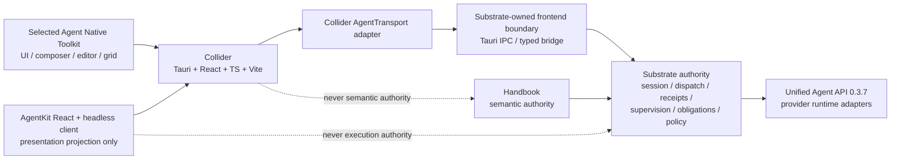
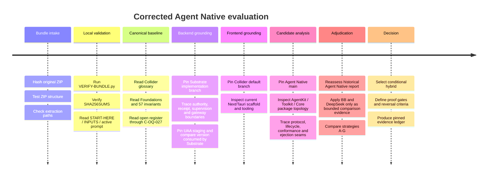

# Corrected Agent Native Evaluation for Collider

## Executive summary

The supplied `collider-agent-native-research-bundle.zip` passed all local integrity and completeness checks I executed. The original ZIP was not modified. Its SHA-256 is `839a95c409eea9f54a9aace4d295224ecad88778a45f07deea1ee713b07abf53`; its SHA-512 is `1338cc57ccd08fd9fc82351aae0ce04cbec60f3854a0708e0fe48bb9e7aa54b7d8324557dba35453482456b94407a802346b2f601f4eb720f5878c452b44e238`. ZIP structure testing passed, a pre-extraction path-traversal check found no unsafe entries, the bundle's own `VERIFY-BUNDLE.py` returned `PASS`, all entries in `SHA256SUMS.txt` verified, the verifier found all 27 open questions and all 57 Foundation invariants, and it reported no broken relative links. The verifier explicitly does **not** constitute source-code/build or historical-citation validation; repository evidence was therefore investigated separately, as required by the handoff. [BND-START, lines 7–11; BND-PROMPT, lines 39–45]

**The corrected recommendation is materially more favorable to Agent Native's frontend layers than the original evaluation, but not to Agent-Native Core as Collider's backend.** The best current strategy is a **hybrid, selected-by-layer adoption**:

> **Shortlist `@agent-native/agentkit` as Collider's agent-interaction protocol/headless-client/controller and React experience layer, backed by a custom Substrate-owned `AgentTransport`; selectively use `@agent-native/toolkit` for presentation, editor/grid/composer/app-shell primitives; retain Collider-native Workstream/Lane/Activity Projection semantics; and do not adopt Agent-Native Core's database, auth, execution, persistence, application-state, or deployment authority.**

That conclusion is conditional rather than an implementation decision. The decisive change since the historical Agent Native assessment is that current Agent Native now has an explicit architectural seam that the old report largely did not have available: **AgentKit is documented and implemented as a provider-neutral protocol, deterministic client/controller, transport layer, conformance kit, and React experience whose backend may be something other than Agent-Native Core.** Agent Native itself says Core owns application state, SQL, execution, auth, access, persistence and deployment, while AgentKit owns protocol/event validation/client state/transports/React composition and **does not** own application data, authorization policy, or execution. fileciteturn12file0L2-L6 This is unusually well aligned with Collider's canonical rule that Handbook owns semantic truth, Substrate owns execution truth, and Collider owns projection, presentation and interaction. [BND-FOUND, lines 72–106]

The most important correction is therefore:

**The old conclusion “do not adopt Agent Native; use it mainly as a design reference” remains substantially correct for Agent-Native Core, but it is now too broad for AgentKit and Toolkit.** The old report correctly rejected importing a cohesive SQL/auth/run-manager framework into Substrate, but current AgentKit gives Collider a plausible way to reuse a coherent frontend controller and interaction stack **without** importing those backend authorities. The historical report's recommendation to reimplement a separate Harness/Session architecture in Substrate is also no longer the right framing: Substrate already consumes Unified Agent API `0.3.7`, and the corrected brief explicitly forbids inventing a second TypeScript CLI-agent backend merely to satisfy a frontend. [BND-OLD-AN, lines 587–695; BND-PROMPT, lines 131–139]

The preferred architecture is:

The critical rule is that an AgentKit `thread`, `run`, client snapshot, task, activity, or optimistic message remains a **frontend/projection identity** unless and until the adapter can truthfully associate it with owner-system state. It must not silently become a Substrate durable orchestration session, a provider Qualified Session, an accepted Invocation receipt, a canonical Activity Source Record, or a Handbook object. Collider's current canon explicitly keeps these identities separate and says UI visibility never owns execution lifetime. [BND-FOUND, lines 82–100, 574–604, 638–652; BND-OQ, lines 158–165, 336–345]

My confidence is **moderate-high that this is the correct shortlist and proof direction**, but only **moderate that AgentKit should actually ship** until four gates are closed: a supported Substrate frontend boundary, a real AgentKit/Substrate transport conformance proof, Tauri/Vite/CSP/performance measurements, and licensing/published-artifact clarification. No Agent Native, Substrate, UAA, or Collider build or runtime test was executed as part of this research; test source was inspected but is not represented as passing evidence.

The pinned machine-readable evidence ledger produced during this evaluation is available here:

[Download the pinned evidence ledger](sandbox:/mnt/data/collider-agent-native-research-outputs/agent-native-collider-evidence-ledger.json)

## Integrity verification and methodology

### Bundle verification

The handoff explicitly required integrity verification before repository investigation and prohibited install hooks or a runtime spike during that check. It also designated `RESEARCH-PROMPT.md` as the sole active brief and required all three canonical Collider documents plus C-OQ-027 to be read before evaluating Agent Native. [BND-START, lines 5–17]

I kept the supplied ZIP unchanged and extracted it into a separate working directory. The verification sequence and results were:

| Verification | Method | Result | Evidentiary meaning |
|---|---|---:|---|
| Original bundle digest | SHA-256 and SHA-512 over the ZIP | **PASS** | Pins exactly the archive evaluated |
| ZIP structural integrity | ZIP test before use | **PASS** | No CRC/archive errors observed |
| Extraction safety | Resolved every member path before extraction | **PASS** | No path-traversal member detected |
| Bundled verifier | `python3 VERIFY-BUNDLE.py` | **PASS** | 12 payload files, 14 total files, 9 Markdown files, 27 open questions, 57 invariants, zero broken relative links |
| Manifest checksums | `sha256sum -c SHA256SUMS.txt` | **PASS** | Every one of the 13 listed entries matched |
| Canonical register identity | Direct SHA-256 | **PASS** | Open-question register = `d437bbf948e9286b97540a67f1d0a04eaa818b625f444cf4814d224b3b5eb04d`, matching `INPUTS.md` |
| Repository/source validation | Pinned live repository reads | **Performed separately** | Necessary because the bundle verifier explicitly does not prove source implementation |
| Builds/install hooks/ejection | Not run | **Intentionally not executed** | Required by research authorization |
| Real agents/runtime spike | Not run | **Intentionally not executed** | Requires separate authorization |

The important bundle input hashes are recorded in the downloadable ledger. In particular, the controlling brief SHA-256 is `189822dda602529f25000a25d34f305dafe04ae4b83285a1c9832b9c2029d6b8`; Foundations is `6a32874cd28bbec5347fbdb79b9f63ea4b3f8206357eee4fa4b446e39309b54a`; and the exact open-question register is the hash above. [BND-INPUTS, lines 20–44]

The original archive itself therefore remained immutable; only a separate extraction directory and a separate output-ledger directory were created.

### Research sequence and pins

The bundle required Substrate and Unified Agent API to be understood before Collider and Agent Native, to avoid evaluating the candidate against an invented backend. [BND-PROMPT, lines 49–105, 107–159] I followed that order and resolved each requested repository head once.

| Repository | Evaluated ref | Pinned commit | Relationship to historical bundle anchor |
|---|---|---|---|
| Substrate | `feat/runtime-refactor-e3-ac1-projection-authority-correction` | `92e87a0092b091f2cef5cf8ccfdc1431e7895b8f` | Advanced from historical `207a358…` fileciteturn2file0L1-L12 |
| Unified Agent API | `staging` | `117995663435eaae89c952563c250045c6aade95` | Same commit as bundle's historical anchor fileciteturn3file0L1-L10 |
| Collider | default `main` | `36ed748eaf613316339fd2d518906a40093294ef` | Same commit as historical anchor fileciteturn5file0L1-L10 |
| Agent Native | default `main` | `c884b5cbe616fe8674586d23c7345d9661de81f5` | Substantially newer than historical `02608a…` fileciteturn7file0L1-L10 |

The Agent Native revision difference is especially important: conclusions from the historical report cannot simply be replayed against the current package architecture.

### Evaluation method

The analysis used the brief's seven strategy families: broad framework adoption; selected packages/controller; source ejection; bounded frontend fork; broader backend-adapting fork; Collider-native implementation; and a hybrid selected by layer. The comparison used the brief's required factors: delivered behavior, remaining product work, adapter mismatch, coherent-stack benefits, Tauri/WebView fit, process/network requirements, dependency and bundle implications, version churn, maintenance/exit cost, security, and licensing. [BND-PROMPT, lines 208–235]

The timeline was:

Evidence is deliberately classified. A source file containing a test is **inspected test source**, not an executed passing test. The only actually executed tests in this evaluation were the bundle integrity/checksum procedures.

## Grounded architecture baseline

### Collider's non-negotiable ownership model

Collider's canonical Foundations define the central architectural constraint more strongly than any package preference: Handbook owns semantic truth, Substrate owns execution truth, and Collider owns projection, presentation, and interaction. Rendering something does not transfer its authority to Collider; owner mutations must return through the appropriate owner boundary. [BND-FOUND, lines 72–106]

The Foundations also state that a Surface can exist inline, Sticky, or as a Tab without becoming the durable owner of what it displays. Closing a Tab, switching Workstreams, or unmounting a component must not stop background work; cancellation is explicit and routed through Substrate. [BND-FOUND, lines 574–604] Qualified Session continuation is separately explicit and visible: staying in one Workstream cannot imply provider/runtime continuation. [BND-FOUND, lines 638–652]

These are not minor UX preferences. They define whether a candidate controller is semantically usable.

### Substrate is already the durable execution control plane

The current Substrate architecture describes itself as a surface-neutral durable control plane: ingress surfaces do not become authority; session authority, dispatch, receipts, supervision, obligations, policy, config projection, gateway credential mediation, and runtime-family realization are separate boundaries. fileciteturn18file0L2-L6

The current authority map is particularly decisive for a frontend integration:

| Concern | Current owner relevant to Collider |
|---|---|
| Session/caller/lineage and durable posture | `HostSessionAuthority` |
| Dispatch orchestration | `WorldDispatchControl` |
| Immutable accepted-work identity | `WorldWorkReceiptRegistry` |
| Durable active observation, replay, caller-drop survival and terminal closeout | `WorldWorkExecutionSupervisor` |
| Producer stream/frame/event ordering | `RuntimeEventTransport` |
| Retained worker lifecycle | `RetainedWorkerRuntime` |
| Obligation truth | `ObligationLedger` |
| Inbox | Derived projection |
| Configuration projection | `AgentConfigProjectionService` |
| UAA side effects | `WorldCommandExecutionBroker` + runtime-family adapter |

Substrate explicitly says the `SurfaceAdapter / HostExecutionEpisode` owns input normalization, live channels, rendering-related episode concerns and bounded recovery ingress, while it **must not own** durable posture, retained continuity, terminal truth, supervisor interpretation, or authority transitions. fileciteturn19file0L2-L6 This maps almost directly to the boundary Collider needs around AgentKit.

A further qualification matters for production-readiness claims: Substrate's current runtime-refactor entrypoint says a seam is considered landed only if the correct authority owns the decision, the real production path uses it, policy is enforced there, and smoke/e2e/regression proof exercises that exact path. It also reports that the secure managed-gateway credential carrier is landed, while direct member Codex/UAA gateway adoption remains transitional; E3-E is incomplete/unlanded and E3-F is not dispatched. fileciteturn17file0L2-L6 Consequently this frontend study must not imply that every eventual production execution path is already integrated merely because the underlying types exist.

### Unified Agent API is already the provider runtime integration layer

Substrate's shell manifest is version `0.2.8`, requires Rust `1.89`, and consumes `unified-agent-api` at exact version `=0.3.7`, with `default-features = false` and the `codex` and `claude_code` features enabled. It separately pins the corresponding wrapper packages at `0.3.7`. fileciteturn22file0L2-L6

UAA staging's public crate remains an agent-agnostic Rust facade. Its contract exposes provider-neutral run requests, event streams, completion, explicit cancellation, capability discovery and runtime support records; importantly, the contract itself warns that “serde-friendly” public types are **not** a statement that the API is already a cross-process/cross-language wire protocol. fileciteturn20file0L2-L6 The UAA crate manifest requires only Rust `1.78`, declares `MIT OR Apache-2.0`, and feature-gates its backends. fileciteturn23file0L2-L6

One UAA lifecycle semantic is critical to the UI design: dropping a run handle or its consumer event stream is a **best-effort cancellation signal** at the UAA layer; deterministic cancellation uses the explicit cancellation handle. UAA also pins completion/event-stream ordering and explicit cancellation behavior. fileciteturn21file0L2-L6

That means Collider **must not directly hand an AgentKit/UI lifecycle ownership of the UAA stream**. Substrate should own the UAA handle and convert provider execution into its durable receipt/supervision model. A UI unmount should merely release its subscription to **Substrate's durable observation**, not drop the underlying provider run handle. This distinction is one of the strongest reasons a real Substrate frontend bridge is necessary.

### Collider is still a scaffold, not a migration-heavy shipped UI

At the pinned Collider revision, the frontend still has Next.js development/build scripts, React `^19.2.4`, TypeScript `^5.9.3`, Tailwind 4-era dependencies, pnpm `10.11.1`, and substantial Storybook/Vitest/Playwright/design-system tooling. fileciteturn24file0L2-L6 The current page itself is still essentially a minimal “Collider” placeholder rather than a fully integrated execution product. fileciteturn28file0L2-L6

The Tauri backend is similarly minimal. Its manifest has Tauri `2.10.3` and Rust `1.77.2`; the current Rust entry point initializes Tauri and a debug logging plugin, but exposes no Substrate/UAA application command layer. fileciteturn25file0L2-L6 fileciteturn26file0L2-L6 The Tauri config still invokes the current Next build, and `app.security.csp` is `null`. fileciteturn27file0L2-L6

This confirms the prompt's framing: moving from current Next source to the fixed **Tauri + React + TypeScript + Vite** destination is common project work, not a reason to penalize Agent Native specifically. Likewise, the existing AI Elements components are explicitly disposable and have no architectural incumbency. [BND-PROMPT, lines 19–35]

The real assets worth preserving are therefore the independent practices and tooling—design tokens where still useful, ds-skills, Storybook/test discipline, visual proof workflows—not the current component API.

## Corrected Agent Native evaluation

### The upstream architecture changed the answer

Current Agent Native has three materially separable layers:

| Layer | What it owns | Fit for Collider |
|---|---|---|
| Agent-Native Core | Actions, SQL, application state, execution, auth/access, persistence, deployment | **Poor as Collider backend** because these responsibilities already have owners |
| AgentKit | Versioned protocol, event validation, headless client/controller, transports, React bindings, agent interaction composition | **Strong conditional fit** for client/projection role |
| Toolkit | Semantic UI controls, composer/design-system/workspace primitives | **Strong selective fit** for presentation |

This ownership split is explicitly documented by Agent Native itself. AgentKit can run against another backend, but that backend must continue to provide execution and security responsibilities. fileciteturn12file0L2-L6

This is the central correction to the 2026 historical evaluation. The old report characterized the framework as too cohesive at the abstraction level then inspected, rejected full Core adoption, and recommended primarily borrowing ideas while reimplementing a narrow harness/session layer in Substrate. [BND-OLD-AN, lines 587–695] That was reasonable against the historical source pin. It is no longer a complete assessment of current Agent Native because current AgentKit creates exactly the provider-neutral frontend seam that Collider needs to investigate.

### AgentKit's protocol fits several difficult Collider invariants unusually well

At the inspected pin, `@agent-native/agentkit` is version `0.2.3`, uses explicit package subpaths for the headless client/protocol, HTTP transport, conformance kit, React surface and focused React entries, and treats React as an optional peer dependency. Its architecture says those subpaths are separate module graphs so non-React protocol consumers do not load the React surface. fileciteturn13file0L2-L6 The protocol version at this pin is explicitly **v2**. fileciteturn34file0L2-L6

Most importantly, the protocol and controller contain direct answers to several of RESEARCH-PROMPT's operational tests.

| Required Collider case | Current AgentKit behavior | Evaluation |
|---|---|---|
| UI close detaches without cancelling work | `SubscribeToRunInput.signal` is documented to cancel only the subscription, not the remote run | **Strong match** |
| Explicit cancellation | `cancelRun({threadId, runId})` is a separate transport method | **Strong match** |
| Reconnect existing work | subscriptions carry `afterSequence`; architecture separates resubscription from retry | **Strong match** |
| Sequence-gap honesty | protocol/conformance validates contiguous event sequences | **Strong match** |
| Optimistic state ≠ durable truth | backend owns durable truth; client owns normalized live projection and optimistic command state | **Strong conceptual match** |
| One behavioral owner | exactly one controller per conversation; duplicate stream/queue/approval owners explicitly forbidden | **Strong match** |
| Capability uncertainty | omission means unknown; unavailable/degraded/unsupported states are explicit in discovery | **Strong match** |
| Approval identity | continuation binds the exact pending request/interrupt identity and explicit decision | **Strong match** |
| App actions | widgets invoke stable action IDs via transport rather than directly mutating host routes/state | **Strong match** |
| Cross-trust references | actor/workspace/access/context fields are references, not authorization grants | **Strong match** |

The underlying `AgentTransport` interface includes `startRun`, `subscribeToRun`, explicit `cancelRun`, optional run lookup/history, actions, uploads, feedback, thread operations, capability discovery and approval/connection continuation. A subscription abort is expressly subscriber-local. fileciteturn33file0L2-L6

AgentKit's architecture separately states that reconnect resumes after the last accepted sequence, network failure must not imply retry, aborting a subscriber must not mutate the remote run, durable snapshots carry replay checkpoints, capability omission means unknown, references are not authorization grants, and sequence gaps are rejected before advancing a cursor. fileciteturn12file0L2-L6

The upstream conformance source is also unusually relevant. It includes named scenarios for completed runs, cancellation, abort/disconnect, reconnect, cross-thread isolation, approval, message queue and terminal failure; it checks event sequence continuity, protocol/wire compatibility, terminal activity closure and truthful capability implementation. fileciteturn36file0L2-L6 In the abort scenario, it explicitly asserts that aborting a subscriber stops event delivery **without cancelling the run**; when resumability is enabled it then reconnects after the last observed sequence. The reconnect test intentionally interrupts a first stream and verifies ordered replay of the same run rather than starting new work. fileciteturn38file0L2-L6

These are **inspected conformance tests, not tests I executed**. Nevertheless, their existence materially lowers the amount of behavioral contract Collider would need to design from scratch.

### Where AgentKit must remain only a projection/adaptation layer

A close architectural fit does not mean names can be mapped one-to-one.

**AgentKit thread ≠ Qualified Session.** Collider canon explicitly says a Workstream can span zero, one, or several provider/runtime Qualified Sessions, and remaining in a Workstream cannot imply provider continuation. [BND-FOUND, lines 638–652] An AgentKit `threadId` should therefore be treated as a presentation/conversation identity—possibly a bounded conversation projection inside a Workstream—not as a provider continuation token.

**AgentKit run ≠ Substrate receipt/Invocation by definition.** `startRun()` returns an AgentKit `runId`, but Substrate only considers work accepted when its receipt/runtime acknowledgement semantics say so. The adapter must not emit an optimistic AgentKit run as if it proved acceptance. Substrate's receipt and supervisor remain authoritative. fileciteturn19file0L2-L6

A defensible adapter would either return a run projection only after the underlying owner boundary has accepted the Invocation or clearly keep a pre-acceptance request identity distinct from accepted work. This needs prototype proof; it should not be guessed in canonical docs.

**AgentKit activities/tasks ≠ canonical Activity Source Records.** They are excellent frontend projection shapes, but Substrate and Collider's Activity Projection model must decide what source evidence they are derived from. AgentKit's own architecture distinguishes tasks from execution evidence, but it cannot grant those values Substrate authority. fileciteturn12file0L2-L6

**AgentKit's approval-resume vocabulary may not equal Substrate's operation lifecycle.** AgentKit v2 models interrupted work so resolving an approval can lead to a new continuation run. fileciteturn33file0L2-L6 Collider therefore needs an adapter mapping between AgentKit's UI-level continuation and whatever exact request/operation identities Substrate's owner API exposes. Exact approval correlation is mandatory; dismissing an Inbox row must remain unrelated to approval. [BND-PROMPT, lines 241–257]

**AgentKit message arrays must not become Collider's model-context authority.** Collider is resolution-reconstructed by default. The transport may use AgentKit messages as UI input/output projection while Substrate/Handbook reconstruct actual invocation context from current owner state. A long thread must not implicitly turn into the model's next prompt context. [BND-FOUND, lines 606–650]

These restrictions do not make AgentKit unusable. They are the adapter contract that makes it usable responsibly.

### Toolkit is an even cleaner fit for non-chat surfaces

`@agent-native/toolkit` is explicitly described as a reusable, **Core-free** UI layer. Runtime state and actions can be supplied through controlled adapters rather than importing Core's backend responsibilities. fileciteturn14file0L2-L6

Its public surface includes app-shell utilities, chat history, collaboration UI, context UI, dashboard components, data-grid, canvas annotations/interactions, design-system adapters, rich editors, sharing UI, UI primitives and hooks. Crucially, its `DataGrid` is documented as an interaction layer that receives rows, columns, editors, selection state and commit callbacks from the host; it does not fetch data, resolve credentials, call actions or persist edits itself. Dashboard follows the same presentation-only pattern. fileciteturn14file0L2-L6

That makes Toolkit a credible candidate for the brief's required **non-chat** proof region. It is much stronger evidence than demonstrating only buttons or tokens.

Toolkit also has first-class source-copy ejection units. The manifest includes units such as app-shell, clipboard, collaboration UI, chat history, canvas interactions/annotations, composer, conformance, context UI, design-system pieces and further feature kits; the AgentKit façade is intentionally marked as a protected seam rather than a source-copy unit. fileciteturn31file0L2-L6

The trade-off is dependency size. Toolkit's package manifest has a broad dependency graph spanning Assistant UI, many Radix packages, Tiptap, Yjs, Recharts and other UI libraries. It has granular browser exports, so imported runtime code can be narrower than the full package, but the installation/dependency footprint is still substantial and needs a real Vite bundle measurement rather than an assumption. fileciteturn39file0L2-L6

### Agent-Native Core should remain out of Collider's authority plane

Current official Agent Native documentation still presents its normal application model as a complete framework. The official Chat template includes durable chat threads, its own agent loop, Better Auth, framework SQL tables for threads/application state/settings/sessions/resources/run history, live SQL sync, extension routes, and admin/observability surfaces. citeturn2search0 Agent Native's broader template model is likewise a complete application with UI, database, auth and agent runtime already wired together. citeturn2search1

Those are strengths for Agent Native's intended standalone application use. They are poor reasons to displace Handbook/Substrate/UAA inside Collider.

Broad Core adoption would create exactly the duplicate-authority risks Collider forbids:

| Core default responsibility | Existing Collider-stack owner | Outcome |
|---|---|---|
| Agent execution | Substrate + UAA | Do not duplicate |
| Durable run/session persistence | Substrate authorities | Do not duplicate |
| SQL application/run state | Existing owner boundaries / future Collider projection store as appropriate | Do not make canonical execution truth |
| Auth/access | Existing host/owner boundary | Do not silently replace |
| Actions that mutate app state | Must route to owner-approved Substrate/Handbook operations | Adapt, do not delegate authority |
| Deployment/server runtime | Tauri target architecture | Not the target deployment model |

AgentKit's own documentation supports exactly this separation: when using a provider-neutral backend, the HTTP/protocol layer does **not** supply authentication, authorization, persistence, tenancy, file storage or agent execution; those are host responsibilities. fileciteturn13file0L2-L6

### Authentication, schemas and trust

The candidate should therefore **not** introduce Better Auth into the Collider architecture merely because Agent Native's standard template uses it. AgentKit can accept host-defined authentication and request context. Its documented generic HTTP handler deliberately separates a trusted, server-resolved request context from client protocol metadata and requires the host to authenticate, scope thread/run operations, validate action payloads, enforce access, and truthfully expose capabilities. fileciteturn13file0L2-L6

Collider may not need AgentKit's HTTP/SSE adapter at all. Because `AgentTransport` is a TypeScript interface, a Tauri-specific transport could call a narrow trusted Tauri IPC boundary instead. That is an **architectural inference**, not implemented evidence. It is attractive because it avoids adding a localhost Node service merely to satisfy AgentKit. It must be proven against the real future Substrate frontend boundary.

Protocol schema quality is comparatively strong. AgentKit's protocol includes runtime-validated, versioned envelopes, durable thread snapshots, replay checkpoints, explicit run and event IDs, object references, approval identities, tasks, activities, widgets, annotations and extension fields. fileciteturn32file0L2-L6 fileciteturn33file0L2-L6 This is a better fit for a browser/Tauri boundary than exposing UAA's Rust structs directly, especially because UAA explicitly does **not** claim its serde-friendly Rust API is a stable frontend serialization contract. fileciteturn20file0L2-L6

### Tauri, Vite and WebView feasibility

Technically, the selected frontend layers look plausible for the target stack:

- Collider already uses React 19.2.x. fileciteturn24file0L2-L6
- AgentKit's React peer is React 19, and Toolkit's peer dependencies are React/React DOM 19. fileciteturn39file0L2-L6
- AgentKit exposes headless/browser/React paths rather than requiring its Core server runtime. fileciteturn13file0L2-L6
- A repository search for Node built-in imports in AgentKit source returned Node imports in test files among the inspected matches rather than demonstrating a required Node runtime in the client implementation; this is supportive but not equivalent to a complete bundler proof. fileciteturn42file0L1-L10 fileciteturn42file1L13-L24

The missing evidence is real: no Vite build, Tauri WebView run, tree-shaken bundle analysis, CSS/Tailwind collision test, keyboard/a11y test or native IPC transport was executed. Therefore “Tauri-compatible” should remain a **high-confidence hypothesis**, not a verified deployment claim.

Current Collider's `csp: null` is also not a production security position for a rich agent UI. fileciteturn27file0L2-L6 Before shipping widgets, Markdown, external links, file references or any agent-authored rendering, the Tauri application needs a deliberate CSP and an explicit policy for navigation, external URL opening, clipboard, uploads and IPC.

### Performance and scalability

AgentKit has several performance-positive architectural features: separate module graphs, a headless controller, resumable event subscriptions, replay cursors and deterministic projection rather than each React component owning streams. fileciteturn12file0L2-L6

There is also one important scaling caution. `AgentDurableThreadSnapshot` is a self-contained projection containing messages, events, runs, activities, tasks, approvals, widgets, agents, interactions, artifacts and suggestions. fileciteturn33file0L2-L6 Mapping a huge, long-lived Workspace-wide history directly into one AgentKit thread could therefore be both semantically wrong and increasingly expensive. Collider already rejects the assumption that it needs one canonical Workspace event log. [BND-FOUND, lines 625–650]

The recommended use is consequently **bounded**: use AgentKit for a coherent agent-interaction projection or selected Workstream conversation surface, backed by paged/bounded owner reads as the adapter permits; do not turn it into the universal Workspace history store just because it has a thread abstraction.

No credible numerical performance estimate can be made without the requested spike.

## Strategy comparison and adoption recommendation

### Comparative result

The following ratings are qualitative judgments based on the evidence above; they are not synthetic benchmark scores or delivery estimates.

| Strategy | Working behavior gained | Authority fit | Candidate-specific integration burden | Upstream/maintenance exposure | Exit path | Result |
|---|---|---|---|---|---|---|
| **Broad Agent-Native framework** — Core + AgentKit + Toolkit | Very high initial framework capability | **Poor**: duplicates auth/data/execution/persistence | High because existing backend must be displaced or double-adapted | High | Difficult | **Reject** |
| **Selected packages including AgentKit controller** | High for chat/agent interaction; good UI primitives | **Strong if transport remains a projection** | Medium: one serious Substrate bridge/adapter | Medium; pre-1.0 packages need pinning | Good | **Strong option** |
| **Toolkit ejection/source ownership** | High for chosen UI regions | Strong | Medium per ejected region | Local patch burden increases | Very good | **Use selectively** |
| **Bounded frontend fork** | Can preserve a coherent experience beyond public seams | Strong if backend stripped out | High | High divergence/merge cost | Moderate | **Contingency, not first choice** |
| **Broader hard fork with backend replacement** | Maximum reused product surface initially | **Poor** | Very high | Very high | Poor | **Reject** |
| **Collider-native clean implementation** | Exactly tailored behavior, no candidate constraints | Excellent | Highest bespoke controller/UI work | Low upstream risk; high internal ownership | Excellent | **Credible fallback** |
| **Hybrid by layer** | Coherent AgentKit interaction + Toolkit reuse + native Collider shell/projections | **Best balance** | Medium | Bounded to selected public seams | Strong | **Recommended** |

### Recommended layer boundaries

**AgentKit protocol/headless client: conditional adopt.** It would save Collider from inventing substantial controller machinery for streaming, projection, reconnect, replay cursors, approvals, queues, optimistic state, capability negotiation and multi-view consistency. Its “one controller per conversation” principle aligns with the brief's explicit permission for a library to implement the client projection role instead of forcing a duplicate Collider controller. fileciteturn12file0L2-L6

**AgentKit React reference surface: adopt where it matches the agent-interaction region, but compose rather than make it the whole Workstream.** Slots, registries and headless composition are preferable to copying private source. AgentKit intentionally has no AgentKit-wide ejection unit. fileciteturn12file0L2-L6

**Toolkit: selectively adopt through public subpaths.** The strongest initial candidates are design-system primitives, composer, app-shell patterns, data-grid/editor capabilities and any dashboard/history components that survive actual product scenario testing. Eject only the smallest region whose supported customization ceiling proves insufficient. fileciteturn14file0L2-L6 fileciteturn31file0L2-L6

**Agent-Native Core: do not adopt as Collider's owner/runtime layer.** It can remain a reference for how AgentKit is used by its first-party backend, but its SQL/auth/application-state/agent-execution/deployment model should not become Collider's new backend. fileciteturn12file0L2-L6

**Collider-native Workstream/Lane/Surface infrastructure: retain.** AgentKit does not replace the distinctive product semantics of Control Plane, Lane-filtered Workstreams, Sticky placements, Surface promotion, Navigator, Qualified Sessions, federated Activity Projection or Handbook-aware context reconstruction. Those are the product.

**Substrate/UAA: unchanged in ownership.** Build one supported frontend API above Substrate. Do not add a parallel TypeScript Codex/Claude execution stack.

### What integrated AgentKit adoption could actually save

The case for AgentKit is not “its chat looks better than existing components.” Existing components are disposable. The real value is avoiding a bespoke implementation of a difficult state machine:

- one behavioral client owner;
- active-run subscription lifecycle;
- detach versus cancel;
- reconnect/replay from a cursor;
- gap detection;
- optimistic versus acknowledged state;
- queue identity;
- exact approval correlation;
- capability negotiation;
- typed errors and correlation IDs;
- rich agent/activity/task/widget rendering;
- coordinated views and registries.

Those are behavioral assets, not merely UI components. The AgentKit conformance source demonstrates that upstream treats several of them as executable transport invariants rather than documentation-only conventions. fileciteturn36file0L2-L6 fileciteturn37file0L2-L6

That is also where the DeepSeek/Cordis comparison remains useful: its historical report argued for authoritative host state → transport → React-free client model → UI projection → React, and for typed presentation extension points rather than making React authoritative. [BND-DEEPSEEK, lines 184–240, 467–622] Current AgentKit independently embodies much of that pattern, which strengthens—not creates—the case for this style of Collider integration.

The BB comparison similarly remains useful for capability truthfulness, host-owned actions with replaceable presentation, renderer fallbacks, reconnect/retry distinctions and explicit lifecycle behavior. It should remain test inspiration rather than imported architecture. [BND-BB]

### Correction ledger

| Prior claim or framing | Corrected assessment | Why it changed |
|---|---|---|
| “Direct/full Agent Native adoption is the wrong abstraction level.” | **Still substantially correct for Core.** | Collider already has stronger semantic/execution owners; current official templates still bring database/auth/runtime behavior. citeturn2search0turn2search1 |
| “Agent Native is mainly a design/conformance reference.” | **No longer correct for all layers.** AgentKit and Toolkit deserve a real adoption proof. | Upstream now exposes provider-neutral AgentKit and Core-free Toolkit. fileciteturn12file0L2-L6 |
| “Reimplement a narrow Harness/Session architecture in Substrate.” | **Outdated as the frontend recommendation.** | Substrate already consumes UAA 0.3.7; the frontend should adapt existing authority rather than create another agent runtime stack. fileciteturn22file0L2-L6 |
| Existing Collider AI Elements should affect migration economics. | **Incorrect under the current owner clarification.** | They are explicitly disposable. [BND-PROMPT, lines 19–35] |
| A candidate controller would necessarily duplicate Collider authority. | **Incorrect if scoped correctly.** | Current canon allows a library to implement a client role; AgentKit explicitly puts durable truth in the backend. [BND-PROMPT, lines 163–180] fileciteturn12file0L2-L6 |
| Agent Native's thread/session model is inherently incompatible. | **Too strong.** | AgentKit thread IDs can remain projection identities, provided they do not imply Qualified Session continuity. |
| Licensing concern can be dismissed because packages say MIT. | **Not yet.** | Current public packages declare MIT, but the monorepo root manifest declares ISC and no root `LICENSE`/`LICENSE.md` was found at the evaluated pin; source-copy/fork distribution still needs clarification. fileciteturn41file0L2-L6 |
| Upstream tests imply integration correctness. | **No.** | Relevant test/conformance source exists but was not executed against Collider/Substrate. |

### Licensing and distribution

Licensing is a separate shipping gate, not a technical veto.

At the current source pin, the AgentKit, Toolkit and Core package manifests inspected in the repository declare MIT at the package level, while the private monorepo root `package.json` declares `"license": "ISC"`. fileciteturn41file0L2-L6 Agent Native's own legal/documentation material describes the open-source framework as MIT licensed. fileciteturn30file4L71-L80

However, the root `LICENSE` and `LICENSE.md` paths returned not found during source inspection. More importantly, I was **not able to independently retrieve and inspect the current npm tarballs** in this environment: registry access from the execution environment failed, and web search did not surface reliable package artifact pages. Therefore I verified package source manifests, export/file declarations and publish-provenance configuration, but **not the actual published tarball byte contents or bundled notice files**.

That leads to a differentiated recommendation:

- **Using published dependencies** can remain on the technical shortlist, subject to normal legal/package due diligence.
- **Ejecting/copying Toolkit source** should not ship until the applicable grant, copyright/notice retention, and generated/ejected-source terms are concretely established.
- **Forking the repository** has an even higher evidence requirement and should not be approved based only on package-level `license` fields or a website statement.
- This report is not a legal opinion.

## Risk, benefit, proof plan, and open questions

### Benefits and risks

| Area | Principal benefit | Principal risk / mitigation |
|---|---|---|
| Architecture | AgentKit closely matches “backend authority, frontend projection” | Do not equate candidate IDs with Substrate/Handbook identities |
| Interaction quality | Substantial ready-made chat/activity/task/approval/widget/controller behavior | Collider still needs unique Workstream/Lane/Surface product composition |
| Lifecycle | Detach, cancel, replay and single-controller rules are unusually aligned | Adapter must subscribe to Substrate durable supervision, never directly couple UI lifetime to UAA handle |
| Development speed | Avoids writing a difficult headless streaming controller from scratch | Pre-1.0 package evolution can create upgrade work; pin exact versions and wrap imports |
| Non-chat UI | Toolkit has real editors/grid/dashboard/app-shell behavior, not just primitives | Large dependency footprint; validate bundle and only import/eject needed regions |
| Tauri | Custom `AgentTransport` could fit a native IPC bridge with no Core server | This path is inferred but unproven; build proof required |
| Security | AgentKit treats refs as non-authoritative and leaves auth to the host | Current Collider CSP is null; rich rendering/IPC must be hardened before shipping |
| Performance | One controller and replay cursors reduce duplicate state/streams | Long durable snapshots could be expensive if misused as universal Workspace history |
| Exit strategy | Public protocol + Toolkit ejection create several escape routes | Ejected source stops receiving upstream fixes automatically |
| Licensing | Package-level MIT declarations are encouraging | Root license inconsistency and uninspected npm tarballs remain a distribution gate |

### Separately authorized proof

The smallest responsible next step is **not** a broad Agent Native migration. It is one bounded, disposable proof branch with no canonical changes and no production dependency commitment.

The spike should contain two scenarios, matching RESEARCH-PROMPT.

**Agent-interaction region.** Use `@agent-native/agentkit` public APIs against a fixture-backed transport first, then a narrow Substrate frontend adapter if that owner API is ready. Demonstrate:

1. a command/request becomes accepted owner work before the UI represents it as accepted;
2. a stream emits ordered activities and a terminal state derived from owner truth;
3. closing/unmounting the view detaches only the observer;
4. reopening reconnects to the same work after its last accepted sequence;
5. explicit Cancel targets the exact active owner operation;
6. uncertain network failure never silently resubmits work;
7. an approval is bound to the exact owner request and explicit decision;
8. unavailable/unsupported/unknown capabilities render differently;
9. two coordinated views share one controller rather than opening parallel streams;
10. missing renderer, stale reference and deliberate sequence-gap cases fail honestly.

These behaviors closely overlap AgentKit's own conformance model, which makes `assertAgentTransportConformance()` a useful candidate test harness, but Collider/Substrate-specific assertions must be added around receipt and authority semantics. fileciteturn36file0L2-L6

**Non-chat Surface.** Select one meaningful Toolkit region—preferably DataGrid, editor, or a configuration/dashboard region—and feed it owner-derived data. Demonstrate that edits produce a validated operation intent through the host adapter; the component must not receive direct filesystem, policy-file, credential or execution authority. Toolkit's documented controlled DataGrid model makes it a good candidate. fileciteturn14file0L2-L6

Measurements should include built JS/CSS size, number of added production dependencies, cold Tauri WebView startup impact, steady-state memory for the tested region, render/update behavior under a realistic event burst, reconnect latency from a populated replay cursor, long-history behavior, keyboard/a11y checks, CSP console violations, and cleanup/leak observations. No target numbers should be invented before establishing Collider baselines.

**Stop conditions:** stop and favor a more Collider-native path if any of the following proves intrinsic rather than adaptational: AgentKit requires a second durable execution owner; subscriber teardown cannot be separated from Substrate work lifetime; truthful receipt semantics cannot fit `startRun`; one controller cannot support the required coordinated views; Vite/Tauri needs a Node sidecar solely for the library; protected/private APIs are required for core scenarios; or normal UI customization requires maintaining a large fork.

### Evidence that would reverse the recommendation

A serious recommendation needs falsifiers. I would reverse or substantially narrow the AgentKit recommendation if the bounded proof establishes that:

- Substrate cannot expose a supported replay/observe/cancel/approval frontend boundary without distorting its authority model;
- AgentKit's `startRun`/terminal/approval lifecycle cannot represent Substrate acceptance and continuation truth without lying;
- AgentKit thread/controller assumptions force Workstream identity to become Session-centric;
- real Tauri/Vite bundling pulls in server/Node runtime dependencies despite the documented package separation;
- required Workstream composition repeatedly needs private AgentKit implementation rather than supported slots/controller APIs;
- package churn is too high to maintain a small compatibility wrapper;
- legal review cannot establish adequate rights/notices for the chosen dependency/ejection/fork mode.

Conversely, if that proof passes, the case for writing a bespoke Collider chat/controller stack from scratch weakens significantly.

### Open-question mapping

This research should **inform**, not silently resolve, the open register.

| Question | Effect of this evaluation |
|---|---|
| `C-OQ-008` — Qualified Session continuity | Strongly reinforces keeping AgentKit thread/run identities separate from provider Qualified Sessions; no automatic continuation |
| `C-OQ-009` — Sticky behavior | AgentKit does not settle it; Toolkit/slots may implement presentation |
| `C-OQ-010` — Tab Promotion/Surface identity | Single-controller injection makes same-state multi-view composition plausible, but Surface identity remains a Collider decision |
| `C-OQ-011` — execution/agent topology | AgentKit activities/tasks are useful projection shapes but do not resolve Substrate execution vocabulary |
| `C-OQ-012` — context lineage | AgentKit metadata/reference fields can transport provenance but cannot become Handbook/Substrate provenance authority |
| `C-OQ-013` — reference architecture | Current AgentKit provides a concrete “durable host → headless client → React” implementation reference |
| `C-OQ-014`–`C-OQ-021` — capability/extensions/UI composition | Toolkit slots/registries/ejection and AgentKit capabilities provide high-value prototype material; no canonical choice follows |
| `C-OQ-023` — environment realization | Unchanged: Substrate owns execution environment realization |
| `C-OQ-024` — workspace execution setup | Candidate UI can present/submit owner-backed setup intents; cannot own config/credential truth |
| `C-OQ-025` — Navigator customization | Toolkit app-shell patterns may help; not resolved |
| `C-OQ-026` — Inbox | AgentKit approval/activity surfaces can help render owner obligations, but dismissal cannot resolve owner work |
| `C-OQ-027` — frontend foundation/reuse | **Research recommendation:** shortlist hybrid AgentKit + Toolkit + Collider-native composition for bounded proof; question remains Open pending proof and adoption decision |

C-OQ-027 itself requires exactly this separation between research, adjudication, proof and canonical amendment, and explicitly says documentation or inspected tests are not executed acceptance evidence. [BND-OQ, lines 336–345]

### Stable work that can proceed independently

Several Workspace Shell activities need not wait for the AgentKit choice: the Next-to-Vite migration, Tauri shell hardening, design-token/tooling consolidation, Navigator/Control-Plane shell composition, explicit Surface placement APIs, accessible focus/tab semantics, presentation-only preferences, generic owner-action dispatch interfaces, and test/Storybook infrastructure. These do not require selecting a chat protocol or closing the open execution vocabulary.

Execution and Binding commitments **should** wait for owner evidence or the spike: the exact Substrate frontend command API, accepted-work/receipt mapping, replay cursor contract, explicit cancel target, approval identity/continuation semantics, capability discovery model, Qualified Session resume boundary, terminal-status source, and durable Activity Projection read APIs. Designing those merely to match AgentKit would violate the research brief and Collider's authority model.

## Pinned source and evidence ledger

The full machine-readable ledger is the authoritative appendix for this report:

**Ledger SHA-256:** `986d97563886b5d6c491f16f7e5857fabe71e4ace54d52b4a43b7c3453da4535`

[Download `agent-native-collider-evidence-ledger.json`](sandbox:/mnt/data/collider-agent-native-research-outputs/agent-native-collider-evidence-ledger.json)

The most decision-relevant evidence is summarized below.

| Evidence ID | Pin / hash | Classification | Decision relevance |
|---|---|---|---|
| `BND-START` | `8c8f18c…` | Verified bundle source | Evaluation procedure and no-modification boundary |
| `BND-PROMPT` | `189822dd…` | Controlling research brief | Metrics, operational tests, alternatives and deliverables |
| `BND-FOUND` | `6a32874c…` | Canonical Collider input | Handbook/Substrate/Collider authority; detach/cancel; session rules |
| `BND-OQ` | `d437bbf9…` | Canonical open register | C-OQ-027 and related unresolved decisions |
| `BND-OLD-AN` | `1808a087…` | Historical evidence | Prior Agent Native conclusion being corrected |
| `PIN-SUBSTRATE` | `92e87a0092b091f2cef5cf8ccfdc1431e7895b8f` | Pinned implementation branch | Actual execution/control-plane authority fileciteturn18file0L2-L6 |
| `SUB-AUTH` | blob `36f60cbe…` | Canonical architecture | Receipt/supervision/Surface nonownership fileciteturn19file0L2-L6 |
| `SUB-SHELL-MANIFEST` | blob `bb31edca…` | Verified manifest | UAA `=0.3.7` adoption and features fileciteturn22file0L2-L6 |
| `PIN-UAA` | `117995663435eaae89c952563c250045c6aade95` | Pinned staging | Current UAA contract baseline |
| `UAA-CONTRACT` | blob `43471136…` | Authoritative contract | Provider-neutral Rust API, not frontend wire protocol fileciteturn20file0L2-L6 |
| `UAA-RUN` | blob `e17a7aa9…` | Authoritative contract | Drop/cancel/finality semantics fileciteturn21file0L2-L6 |
| `PIN-COLLIDER` | `36ed748eaf613316339fd2d518906a40093294ef` | Pinned current scaffold | Current-vs-target migration baseline |
| `COLLIDER-PKG` | blob `10ac1c2e…` | Verified manifest | Next/React/tooling baseline fileciteturn24file0L2-L6 |
| `COLLIDER-TAURI-LIB` | blob `69f4491c…` | Verified implementation | No current Substrate frontend command bridge fileciteturn26file0L2-L6 |
| `COLLIDER-TAURI-CONF` | blob `640295e9…` | Verified config | Current Next integration and null CSP fileciteturn27file0L2-L6 |
| `PIN-AGENTNATIVE` | `c884b5cbe616fe8674586d23c7345d9661de81f5` | Pinned candidate | Corrected current candidate |
| `AN-AGENTKIT-ARCH` | blob `5362635a…` | Documented architecture | Provider-neutral split, one controller, security/ownership invariants fileciteturn12file0L2-L6 |
| `AN-PROTOCOL` | blob `66237152…` | Verified source/API | `AgentTransport`, explicit cancel, subscription abort, snapshots fileciteturn33file0L2-L6 |
| `AN-CONFORMANCE` | blob `3c2e86fb…` | Inspected test source, **not executed** | Detach/reconnect/cancel/approval/gap test contract fileciteturn36file0L2-L6 |
| `AN-TOOLKIT-README` | blob `8c63ab3e…` | Public architecture/docs | Core-free presentation and controlled non-chat UI fileciteturn14file0L2-L6 |
| `AN-EJECT` | blob `8a5dd1a4…` | Verified manifest | Supported source ownership units fileciteturn31file0L2-L6 |
| `AN-ROOT-PKG` | blob `8dce9922…` | Verified manifest | Root ISC declaration, scripts/guards/test inventory fileciteturn41file0L2-L6 |

The final disposition is therefore:

> **Do not adopt or fork Agent-Native Core as Collider's operational foundation. Do not reimplement a duplicate CLI-agent backend. Put the current AgentKit + Toolkit combination on the serious shortlist as a frontend technology, with AgentKit acting only as a client/projection layer through a Substrate-owned transport boundary and Toolkit supplying selectively adopted presentation. Preserve Collider-native Workstream/Lane/Surface semantics around that layer. The smallest next decision is authorization of one bounded AgentKit transport + substantial Toolkit Surface proof; only a passing proof plus licensing/artifact clarification should convert this research recommendation into a dependency or architecture commitment.**