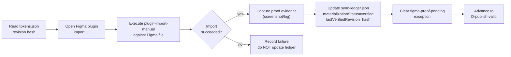
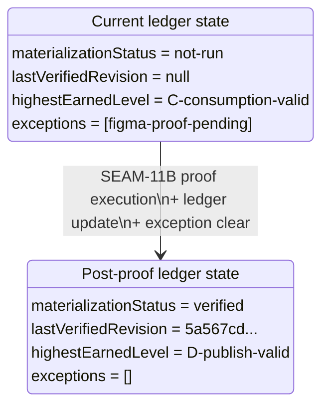
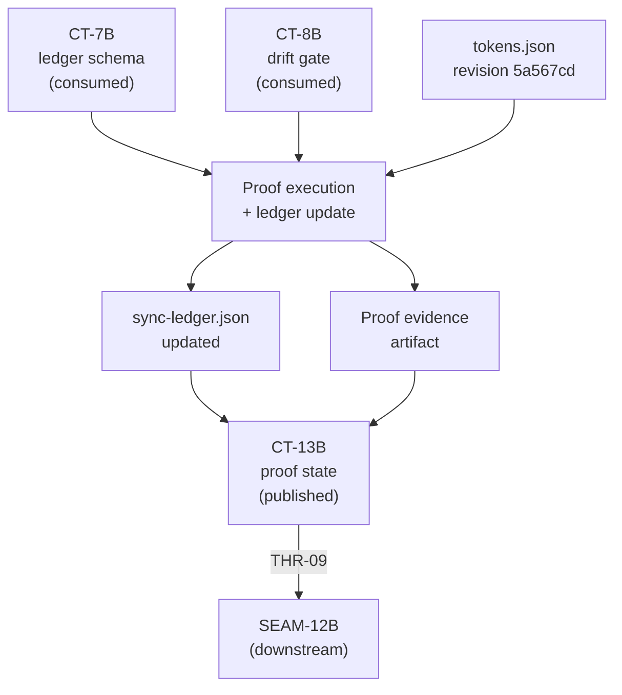

# Review Bundle - SEAM-11B Current-Revision Figma Publish Proof Refresh

This artifact feeds `gates.pre_exec.review`.
`../../review_surfaces.md` is pack orientation only.

## Falsification questions

1. **Can the proof claim `verified` against a stale revision?** If the artifact at `design-tokens/dist/figma/tokens.json` has changed between seam planning and proof execution, the revision hash in the ledger would be wrong. The proof must re-read the current revision at execution time and fail if it does not match the expected hash.

2. **Can the ledger advance to `D-publish-valid` without the `figma-proof-pending` exception being resolved?** The current exception is `blocking: true`. If the ledger update writes `highestEarnedLevel: D-publish-valid` but leaves the exception open, the ledger would be internally inconsistent. The exception resolution must be atomic with the level advancement.

3. **Can SEAM-12B consume CT-13B before the proof evidence artifact actually exists?** CT-13B carries the proof state, but if the contract is defined without a concrete evidence path, SEAM-12B promotion could proceed against an unverifiable claim. The contract definition must include the evidence artifact path as a required field.

## R1 - Proof execution workflow

## R2 - Sync-ledger state transition

## R3 - Contract and thread flow (seam-local)

## Likely mismatch hotspots

- **Revision drift between planning and execution**: The seam brief hardcodes revision `5a567cd7d07860135ab0bfb1d8f2873ef1eec836`. If `design-tokens/dist/figma/tokens.json` has been rebuilt since extraction, the proof must use the actual current revision, not the planned one.

- **Exception clearing without proof linkage**: The `figma-proof-pending` exception must be cleared only when proof evidence references the same revision written to `lastVerifiedRevision`. A mismatch would leave the ledger in an unverifiable state.

- **Figma file state drift**: The Figma file may have been manually edited since the last known-good state. The proof must succeed against the file as-is or document what remediation is needed.

## Pre-exec findings

- **Finding 1**: The basis records revision `5a567cd7d07860135ab0bfb1d8f2873ef1eec836` from extraction time. The actual revision in the repo must be verified at execution time. **Disposition**: No remediation needed — the proof procedure naturally reads the current revision. The slice acceptance criteria require the proof to verify against whatever the current revision is at execution time.

- **Finding 2**: No open remediations block this seam. The remediation log is clean. **Disposition**: No action needed.

## Pre-exec gate disposition

- **Review gate**: pending (this review documents the shape; gate passes when slice planning is confirmed)
- **Contract gate concerns**: CT-13B does not yet exist. S2 creates it. Gate passes when CT-13B is defined.
- **Revalidation prerequisites**: All upstream closeouts are landed. Basis is `current`. Revalidation gate: `passed`.
- **Opened remediations**: none

## Planned seam-exit gate focus

- **What must be true before downstream promotion is legal**: sync-ledger.json shows `materializationStatus: verified` with a non-null revision, `figma-proof-pending` exception is resolved, `highestEarnedLevel` is `D-publish-valid`, CT-13B is defined with evidence path, THR-09 is advanced to `defined`.
- **Which outbound contracts/threads matter most**: CT-13B (carries proof state to SEAM-12B), THR-09 (carries proof freshness — SEAM-12B needs to know the current rail works).
- **Which review-surface deltas would force downstream revalidation**: If the proof reveals the plugin-import-manual rail does not work cleanly (e.g., partial import, missing variables), SEAM-12B's assumptions about "the current rail works" would need revision.
