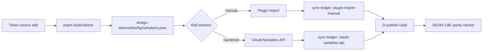
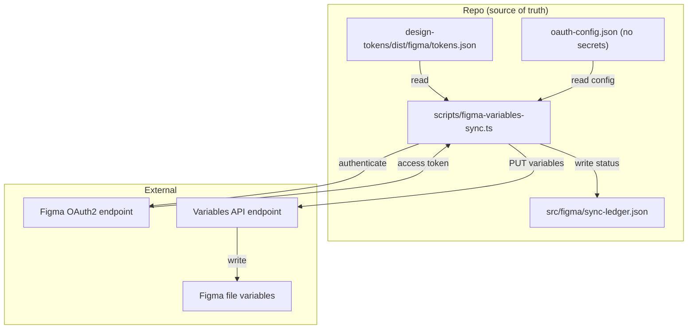
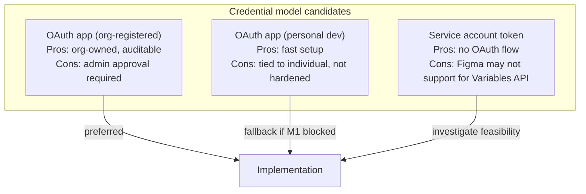

# Review Bundle - SEAM-12B Hardened Figma Variables Rail

This artifact feeds `gates.pre_exec.review`.
`../../review_surfaces.md` is pack orientation only.

## Falsification questions

1. **Can the hardened rail silently diverge from the plugin-import-manual rail's output?** If the OAuth/Variables API writes a different variable state than the plugin import produces for the same input artifact, the two rails are not equivalent and SEAM-13B cannot safely ratchet parity. The contract must define equivalence criteria.

2. **Can the OAuth credential model degrade into personal-token dependency without detection?** If the credential model allows fallback to personal tokens or undocumented env vars, the rail is not hardened — it just moves the manual interpretation to a different layer. The implementation must enforce and verify the credential model programmatically.

3. **Can the Figma Variables API scope requirements block the entire seam without a known fallback path?** If OAuth app registration requires organization admin approval with an unbounded timeline, and no alternative scope configuration exists, the seam may be permanently blocked by an external dependency. Pre-exec review must characterize the scope requirements and approval path before committing to implementation.

## R1 - Publish workflow: dual-mode rail

The hardened rail is additive. Both rails write to sync-ledger.json with distinct mode identifiers. The plugin-import-manual rail remains functional as fallback.

## R2 - Data flow: OAuth/Variables API rail

Key: the command reads tokens, authenticates via OAuth, writes variables, then records machine-readable status in the ledger. No manual step in the loop.

## R3 - Credential model options

The contract definition (S1) must specify which model is selected and why.

## Likely mismatch hotspots

- **Ledger schema extension vs. CT-7B**: Adding hardened rail fields to sync-ledger.json must stay within the v2 schema shape defined by CT-7B. If the hardened rail needs fields that CT-7B doesn't accommodate, this becomes a schema migration — which is out of scope.
- **Variables API scope vs. OAuth app type**: The Figma Variables API may require scopes that are only available to certain OAuth app types (e.g., organization-level apps). If the credential model selected doesn't have access to the required scopes, the implementation will fail at runtime with no pre-exec signal.
- **Determinism definition**: "Same input produces same Figma state" is the stated invariant, but Figma may add metadata (timestamps, version IDs) that differ between runs. The contract must define what "same state" means at the variable-value level, not the full API response level.
- **CT-13B freshness at activation**: When SEAM-12B activates, CT-13B must still reflect current reality. If the artifact revision changed between SEAM-11B landing and SEAM-12B activation, THR-09 is stale and revalidation is required before execution.

## Pre-exec findings

- **F1 (revalidation)**: SEAM-11B landed 2026-03-22. CT-13B published at `artifacts/harness/ct-13b-figma-proof-state.md` with all 3 satisfaction criteria met. THR-09 advanced to `defined`. Artifact revision unchanged at `2ee89e27306a1caa846d904ad6229370f371b1b3`. sync-ledger.json matches closeout exactly: `materializationStatus: passed`, `lastVerifiedRevision: 2ee89e27306a1caa846d904ad6229370f371b1b3`, `highestEarnedLevel: D-publish-valid`, `exceptions: []`. **No remediation needed** — basis is now current.
- **F2 (CT-13B freshness hotspot)**: The mismatch hotspot "CT-13B freshness at activation" is resolved: the artifact revision has not changed since SEAM-11B landing, so THR-09 is current and the proof baseline is valid. **No remediation needed.**
- **F3 (alpha-channel limitation)**: SEAM-11B closeout notes that figma-use CLI strips alpha channels from hex8 values. This is a known tool constraint, not a proof deficiency. The hardened OAuth/Variables API rail (this seam's scope) is expected to resolve it by writing variables directly via API rather than through the CLI tool. **No remediation needed** — this validates the need for this seam.
- **F4 (external dependency)**: Figma OAuth app registration path and Variables API scope requirements remain uncharacterized. This is an acknowledged execution risk (falsification Q3), not a gate blocker. De-risk plan: characterize scope and approval path early in S2.T1.

## Pre-exec gate disposition

- **Review gate**: passed — falsification questions are well-defined and actionable; review surfaces R1–R3 accurately represent the planned work shape; mismatch hotspots are addressed or acknowledged with de-risk plans
- **Contract gate**: passed — CT-14B produced by SEAM-12B, CT-13B consumed from SEAM-11B, THR-09 consumed, THR-10 produced; all match authoritative threading.md contract ownership and dependency directionality
- **Revalidation gate**: passed — SEAM-11B landed with CT-13B published, THR-09 advanced, artifact revision unchanged, sync-ledger matches closeout, no stale triggers fired
- **Opened remediations**: none

## Planned seam-exit gate focus

- **What must be true before downstream promotion is legal**: The hardened rail must execute successfully against the current artifact and target Figma file; CT-14B must be published with deterministic success markers; THR-10 must be advanced to `defined`; sync-ledger.json must show dual-mode rail status
- **Which outbound contracts/threads matter most**: CT-14B (SEAM-13B needs the hardened rail to be real before ratcheting parity); THR-10 (carries rail readiness to SEAM-13B)
- **Which review-surface deltas would force downstream revalidation**: R1 workflow gaining the automated publish path; R2 data flow showing dual-mode rail; any change to the credential model or Variables API scope that affects the rail's operational status
- **Upstream handoff consumed**: SEAM-11B closeout confirms plugin-import-manual rail works at revision `2ee89e27306a1caa846d904ad6229370f371b1b3`. The hardened rail should produce equivalent or better results for the same input. The alpha-channel limitation in figma-use CLI is a known tool constraint that this seam's OAuth/Variables API rail is expected to resolve.
