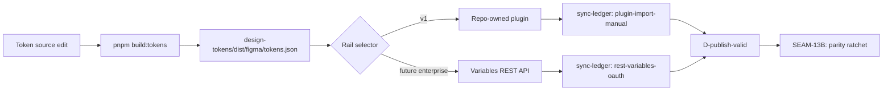

# Review Bundle - SEAM-12B Hardened Figma Variables Rail

This artifact feeds `gates.pre_exec.review`.
`../../review_surfaces.md` is pack orientation only.

## Falsification questions

1. **Can the plugin rail silently diverge from the repo artifact?** If the plugin materializes a different variable state than the token artifact implies (especially for `rgba(...)` alpha colors and `duration`), the rail is not deterministic and downstream parity tightening is unsafe.

2. **Can the plugin safely replace the target collection?** If the destination file contains a remote/published collection with the target name, removal may be forbidden; the plugin must fail with a clear operator message and not partially apply.

3. **Is the operator loop reviewable without API access?** The plugin must produce a copyable run report so maintainers can update `src/figma/sync-ledger.json` without inventing state.

## R1 - Publish workflow: dual-mode rail



The Enterprise rail is optional future work. The plugin rail is the v1 canonical posture.

## R2 - Data flow: plugin rail

```mermaid
flowchart TB
  subgraph Repo ["Repo (source of truth)"]
    TOKENS["design-tokens/dist/figma/tokens.json"]
    LEDGER["src/figma/sync-ledger.json"]
  end

  subgraph Operator ["Operator machine"]
    SERVER["localhost server (optional)"]
    PLUGIN["Collider Token Sync plugin"]
  end

  subgraph Figma ["Figma"]
    FILE["Pilot file variables"]
  end

  TOKENS -->|serve or upload| SERVER
  SERVER -->|fetch| PLUGIN
  TOKENS -->|file upload| PLUGIN
  PLUGIN -->|create/replace local collection| FILE
  PLUGIN -->|run report (copy/paste)| LEDGER
```

Key: the plugin reads tokens, writes variables, verifies counts/values, then emits a run report for the operator to record in the ledger.

## R3 - Enterprise rail (deferred)

The Variables REST API rail remains Enterprise-only and is explicitly out of scope for v1 execution. This seam treats `plugin-import-manual` as the canonical rail and keeps `promotion.parityMode="deferred"`.

## Likely mismatch hotspots

- **Determinism definition**: "Same input produces same Figma state" is the stated invariant, but Figma may add metadata (timestamps, version IDs) that differ between runs. The contract must define what "same state" means at the variable-value level, not the full API response level.
- **CT-13B freshness at activation**: When SEAM-12B activates, CT-13B must still reflect current reality. If the artifact revision changed between SEAM-11B landing and SEAM-12B activation, THR-09 is stale and revalidation is required before execution.

## Pre-exec findings

- **F1 (revalidation)**: SEAM-11B landed 2026-03-22. CT-13B published at `artifacts/harness/ct-13b-figma-proof-state.md` with all 3 satisfaction criteria met. THR-09 advanced to `defined`. Artifact revision unchanged at `2ee89e27306a1caa846d904ad6229370f371b1b3`. sync-ledger.json matches closeout exactly: `materializationStatus: passed`, `lastVerifiedRevision: 2ee89e27306a1caa846d904ad6229370f371b1b3`, `highestEarnedLevel: D-publish-valid`, `exceptions: []`. **No remediation needed** — basis is now current.
- **F2 (CT-13B freshness hotspot)**: The mismatch hotspot "CT-13B freshness at activation" is resolved: the artifact revision has not changed since SEAM-11B landing, so THR-09 is current and the proof baseline is valid. **No remediation needed.**
- **F3 (alpha-channel correctness)**: The v1 plugin rail must correctly parse and materialize alpha-channel colors (`#RRGGBBAA`, `rgba(...)`). This is verified by unit tests on the shared mapping module, and by in-plugin value verification after each sync run.

## Pre-exec gate disposition

- **Review gate**: passed — falsification questions are well-defined and actionable; review surfaces R1–R3 represent the v1 plugin rail and the deferred Enterprise rail correctly; mismatch hotspots are addressed or explicitly scoped out
- **Contract gate**: passed — CT-14B produced by SEAM-12B, CT-13B consumed from SEAM-11B, THR-09 consumed, THR-10 produced; threading and ownership remain consistent
- **Revalidation gate**: passed — SEAM-11B landed with CT-13B published, THR-09 advanced, artifact revision unchanged, sync-ledger matches closeout
- **Opened remediations**: none

## Planned seam-exit gate focus

- **What must be true before downstream promotion is legal**: The plugin rail must execute successfully against the current artifact and pilot file; CT-14B must be published; THR-10 must be advanced to `defined`; sync-ledger.json must be verified-current for the active revision with `publish.mode="plugin-import-manual"`.
- **Which outbound contracts/threads matter most**: CT-14B and THR-10.
- **Which review-surface deltas would force downstream revalidation**: Any change to mapping rules, verification semantics, or collection/mode naming that affects determinism or operator workflow.
- **Upstream handoff consumed**: SEAM-11B closeout confirms plugin-import-manual rail works at revision `2ee89e27306a1caa846d904ad6229370f371b1b3`. SEAM-12B must preserve that proof posture while eliminating manual value transcription and tightening determinism checks.
