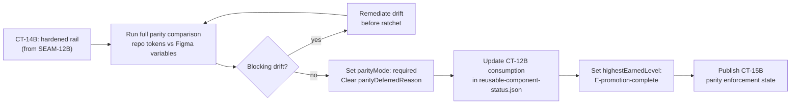
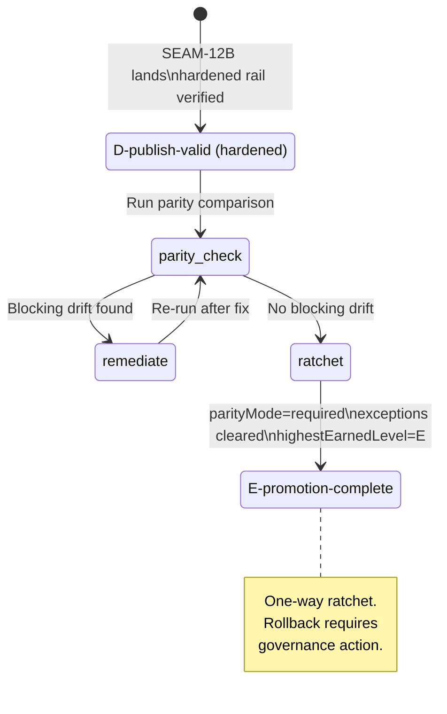
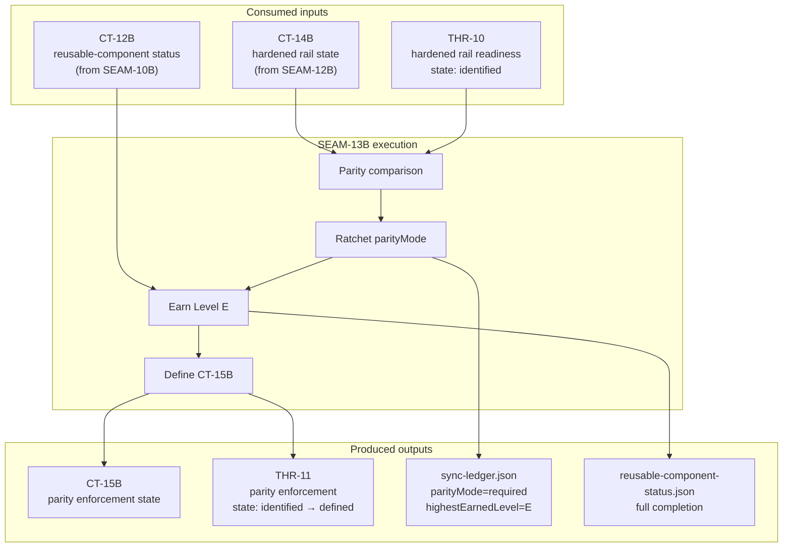

# Review Bundle - SEAM-13B Required Parity Ratchet and Promotion

This artifact feeds `gates.pre_exec.review`.
`../../review_surfaces.md` is pack orientation only.

## Falsification questions

1. **Can parity be ratcheted to required while the hardened rail is absent or broken?** The ratchet depends on CT-14B (hardened rail state) being published with a working rail. If SEAM-12B lands but the rail has partial failures or the OAuth credential model is incomplete, the ratchet could lock in a required parity state that can't actually be enforced. The one-way nature makes this dangerous — rollback requires governance action.

2. **Can `highestEarnedLevel: E-promotion-complete` be set while blocking exceptions still exist in sync-ledger.json?** The Level E claim requires no blocking drift. If the parity comparison reveals previously hidden divergence between repo tokens and Figma variables (the seam brief's primary risk), the promotion could be set prematurely, making downstream attestation (SEAM-14B) rely on a false completion state.

3. **Is CT-12B (reusable-component status) current enough to consume, or could SEAM-10B's landed state have drifted?** CT-12B was published by SEAM-10B in the `harness-future-rails` pack. If any harness-completion work has modified `artifacts/harness/reusable-component-status.json` since CT-12B was published, the consumption may be against stale data.

## R1 — Parity ratchet workflow

## R2 — Data flow through ledger state transitions

## R3 — Contract and thread flow for SEAM-13B

## Likely mismatch hotspots

- **Parity comparison revealing hidden drift**: The plugin-import-manual rail (SEAM-11B) proved 19/19 solid-color tokens and 2/2 RGBA base-color tokens matched. But the hardened Variables API rail (SEAM-12B) may write tokens differently or cover a broader scope. The parity comparison at ratchet time may surface mismatches that didn't exist under the manual rail.
- **CT-12B staleness**: `reusable-component-status.json` was published by SEAM-10B (harness-future-rails). If any intermediate seam has modified this file, the consumption basis could be stale. Need to verify the file hasn't changed since CT-12B was published.
- **Enforcement wiring gap**: The seam brief says "wire release-governed parity enforcement to the current repo-owned hardened rail status." This assumes enforcement scripts or CI checks exist that can read `parityMode` and act on it. If these don't exist yet, the ratchet is a policy change without enforcement teeth.

## Pre-exec findings

- **F1 — Basis is provisional**: SEAM-12B has not landed. CT-14B is not published. THR-10 is `identified`. All planning is against assumed future state. This is expected for a `next` seam and does not open a remediation, but revalidation is mandatory before activation.
- **F2 — Parity comparison procedure is undefined**: The seam brief describes a full parity comparison but doesn't specify the tool or method. SEAM-11B used `figma-use` CLI. SEAM-12B's hardened rail may provide a different comparison surface. The comparison procedure should be defined in S2 based on whatever CT-14B actually publishes.
- **F3 — Enforcement wiring scope is ambiguous**: "Wire release-governed parity enforcement" could mean updating an existing CI check, creating a new one, or simply documenting the policy. The scope should be clarified during revalidation when the hardened rail's actual shape is known.

No remediations are opened. F1 is expected next-seam posture. F2 and F3 are implementation details that depend on upstream landing and will be resolved during revalidation.

## Pre-exec gate disposition

- **Review gate**: pending — review bundle is complete but basis is provisional
- **Contract gate concerns**: CT-15B shape depends on CT-14B reality. Contract definition (S1) should be written provisionally and revalidated after SEAM-12B lands.
- **Revalidation prerequisites**: SEAM-12B must land with CT-14B published and THR-10 advanced to at least `defined`. Once landed: (1) consume SEAM-12B closeout, (2) confirm CT-14B satisfaction criteria, (3) revalidate parity comparison procedure against actual hardened rail shape, (4) confirm CT-12B has not drifted since SEAM-10B publication.
- **Opened remediations**: none

## Planned seam-exit gate focus

- **What must be true before downstream promotion is legal**: `parityMode: required` with no `parityDeferredReason` in sync-ledger.json, `highestEarnedLevel: E-promotion-complete`, empty or non-blocking `exceptions` array, `reusable-component-status.json` reflecting full completion, CT-15B published with explicit satisfaction criteria.
- **Which outbound contracts/threads matter most**: CT-15B (SEAM-14B's primary input for attestation), THR-11 (carries Level E reality to SEAM-14B)
- **Which review-surface deltas would force downstream revalidation**: R3 state machine reaching Level E terminal state changes the attestation surface SEAM-14B will reconcile against. Any exceptions remaining in sync-ledger.json at closeout would force SEAM-14B to account for them.
