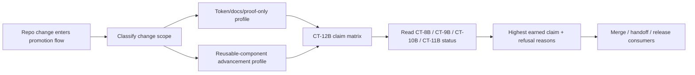
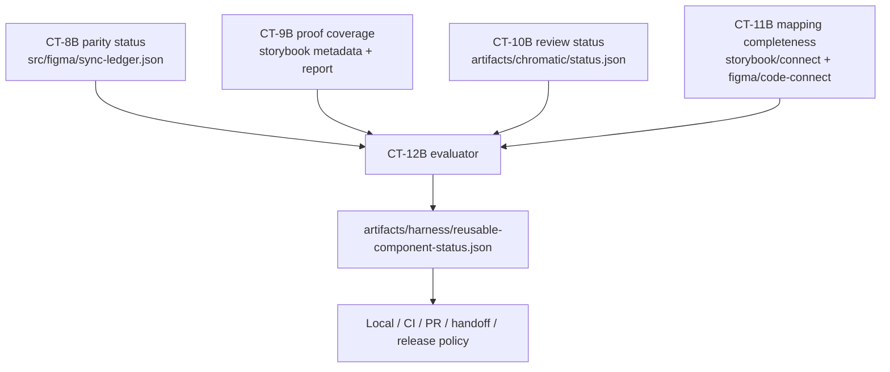
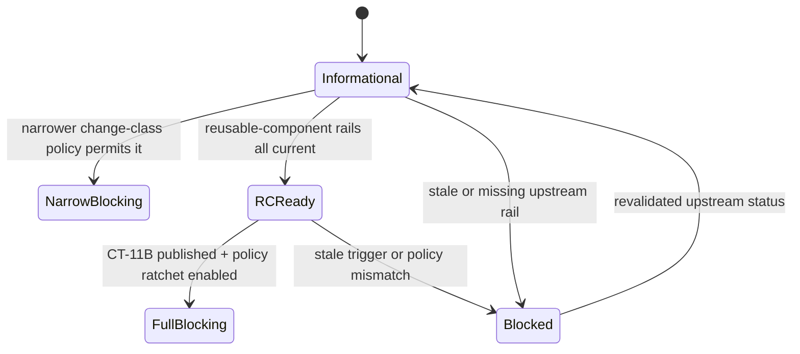

# Review Bundle - SEAM-10B Reusable Component Promotion Convergence

This artifact feeds `gates.pre_exec.review`.
`../../review_surfaces.md` is pack orientation only.

## Falsification Questions

- Can the planned `CT-12B` contract still let a merge, handoff, or release consumer claim full reusable-component readiness when mapping completeness is missing, stale, or only anecdotal because `THR-07` is not yet published?
- Could the promotion policy accidentally broaden proof, review, mapping, and parity requirements onto token-only, docs-only, or proof-only changes because change classes are not explicit in the claim matrix?
- Does the proposed status artifact duplicate or reinterpret upstream `CT-8B`, `CT-9B`, `CT-10B`, or future `CT-11B` facts instead of naming which published revision and outcome it consumed?

## R1 - Change-Class-Aware Promotion Decision Flow

## R2 - Upstream Status Aggregation Into CT-12B

## R3 - Informational Versus Blocking Ratchet

## Likely Mismatch Hotspots

- `THR-07` is still `identified`, so any draft that treats mapping completeness as current basis or blocking policy today is overclaiming relative to the active seam handoff.
- Promotion consumers can easily collapse informational and blocking semantics if `CT-12B` does not encode change class, enforcement mode, and refusal reasons separately.
- The status artifact can drift into a second source of truth if it copies upstream payloads instead of recording revision, freshness, and summarized outcome.
- Review and proof may be current while parity or mapping is stale, so the contract must name mixed-state refusal behavior rather than forcing one binary result.

## Pre-Exec Findings

- The seam is valid to decompose now because `CT-8B`, `CT-9B`, and `CT-10B` are published, their consumers are explicit in `threading.md`, and the seam brief already narrows the key decision surface to claim scoping and refusal behavior.
- The basis remains provisional by design because `SEAM-9B` is still active and `THR-07` has not yet been published. That means this seam can freeze contract shape and consumer boundaries now, but it must not promote to `exec-ready` or finalize mapping-required blocking claims yet.
- `REM-004` is the seam-owned follow-up that this decomposition is meant to close. No additional pre-exec remediation is opened yet because the current blocker posture is already explicit in the pack governance.

## Pre-Exec Gate Disposition

- **Review gate**: pending. The review bundle is authoritative, but the next seam still requires human review against the actual `SEAM-9B` handoff before promotion.
- **Contract gate concerns**: `CT-12B` must stay additive to upstream status contracts, keep change-class scoping explicit, and avoid making mapping-dependent claims authoritative before `CT-11B` is published.
- **Revalidation prerequisites**: `../../governance/seam-9b-closeout.md` must publish `THR-07` with a passed seam-exit handoff; `CT-8B`, `CT-9B`, and `CT-10B` field-consumption boundaries must remain unchanged from `threading.md`.
- **Opened remediations**: none from this pre-exec review. `REM-004` remains the active seam-owned follow-up.

## Planned Seam-Exit Gate Focus

- **What must be true before pack completion or blocking promotion is legal**: `CT-12B` is published with explicit claim profiles, informational-versus-blocking semantics, and consumed upstream revisions; any mapping-required claim is backed by a published `CT-11B` handoff rather than prose.
- **Which outbound contracts/threads matter most**: `CT-12B` publication plus explicit consumption of `THR-05`, `THR-06`, `THR-07`, and `THR-08` at their recorded states.
- **Which review-surface deltas would force revalidation**: any change to change-class scoping, proof-tier policy, visual-review requiredness, parity claim semantics, or the `CT-11B` completeness boundary.
