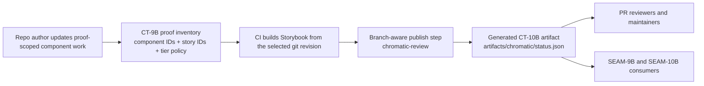
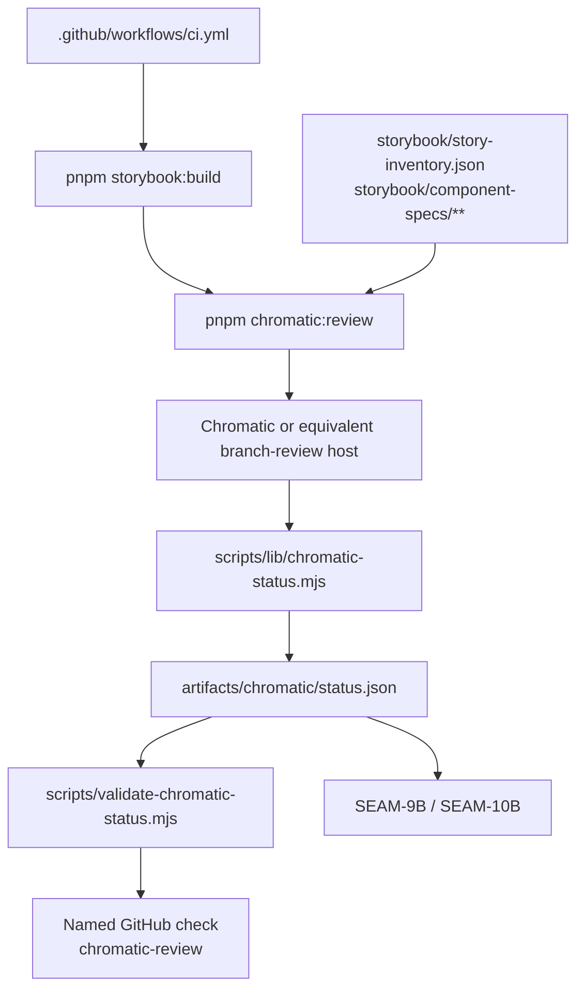
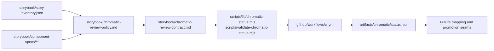
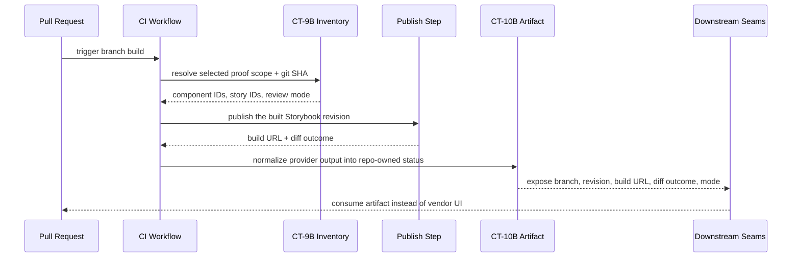

# Review Bundle — SEAM-8B Branch-Aware Visual Review Convergence

## Falsification Questions

- Can the visual-review rail publish against a Storybook build that does not match the proof inventory revision and selected component scope from `CT-9B`?
- Can `chromatic-review` appear healthy while `artifacts/chromatic/status.json` is missing, stale, or only records human-readable vendor output?
- Could downstream mapping or promotion seams consume build URLs or review conclusions directly from a vendor UI instead of the repo-owned `CT-10B` artifact?

## R1 — Branch-Aware Review Publication Workflow

## R2 — CI And Status-Normalization Data Flow

## R3 — Touch-Surface Handoff Map

## R4 — Sequence For Optional-To-Consumable Review Status

## Likely Mismatch Hotspots

- `SEAM-7B` may still change proof-scope shape, so a review selector built too early could drift from the final `CT-9B` inventory contract.
- The current CI file only builds Storybook; a rushed publish step could emit vendor output without guaranteeing the generated `CT-10B` artifact is written on success, diff, and failure paths.
- Review-mode semantics can drift if the named check implies blocking behavior before `SEAM-10B` formally promotes the rail from optional to required for reusable-component claims.

## Reviewer Checklist

- The diagrams describe the actual Storybook publish, normalization, and downstream-consumption work that would land, not only seam topology.
- Contract ownership matches `threading.md`: `SEAM-8B` owns `CT-10B`; `SEAM-7B` remains the authority for proof selection via `CT-9B`.
- The flow prevents downstream consumers from reading vendor-only state or a mismatched Storybook revision.
