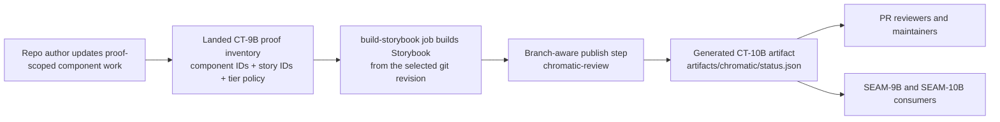
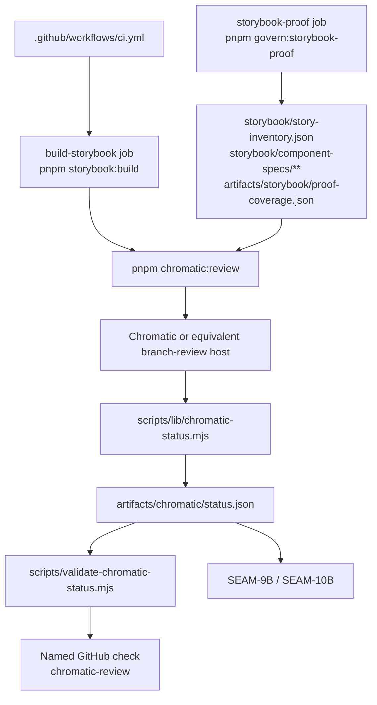
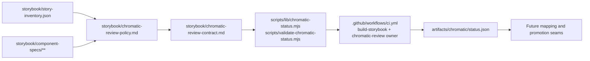
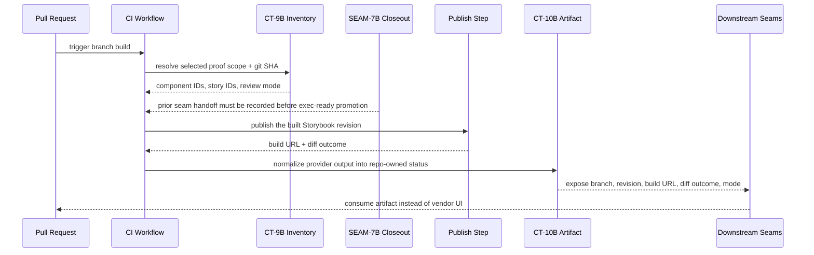

# Review Bundle — SEAM-8B Branch-Aware Visual Review Convergence

## Falsification Questions

- Can the visual-review rail publish against a Storybook build that does not match the landed `CT-9B` proof inventory revision and selected component scope?
- Can the seam claim active-window readiness when the upstream `SEAM-7B` closeout still lacks the realized `seam_exit_gate` handoff record required by the promotion rules?
- Can `chromatic-review` appear healthy while `artifacts/chromatic/status.json` is missing, stale, or only records human-readable vendor output?
- Could downstream mapping or promotion seams consume build URLs or review conclusions directly from a vendor UI instead of the repo-owned `CT-10B` artifact?

## R1 — Branch-Aware Review Publication Workflow

## R2 — CI And Status-Normalization Data Flow

## R3 — Touch-Surface Handoff Map

## R4 — Sequence For Optional-To-Consumable Review Status

## Likely Mismatch Hotspots

- `SEAM-7B` no longer risks changing `CT-9B`, but its closeout is missing the realized `seam_exit_gate` record that `SEAM-8B` needs before pre-exec revalidation can pass.
- The current CI file already has `storybook-proof` and `build-storybook` jobs, but no dedicated `chromatic-review` owner; a rushed publish step could emit vendor output without guaranteeing the generated `CT-10B` artifact is written on success, diff, deferred, and failure paths.
- Review-mode semantics can drift if the named check implies blocking behavior before `SEAM-10B` formally promotes the rail from optional to required for reusable-component claims.
- Downstream seams could still bypass the repo-owned contract if build URLs or review conclusions are summarized in prose or vendor UI links without matching `artifacts/chromatic/status.json`.

## Findings And Blocker Posture

- `CT-9B` is landed and consumable through `storybook/story-inventory.json`, `storybook/component-tier-policy.json`, `storybook/component-specs/button.json`, `artifacts/storybook/proof-coverage.json`, and `pnpm govern:storybook-proof`.
- The active seam basis is current against repo reality: Storybook still builds through `pnpm storybook:build`, `build-storybook` remains the closest publish precursor, and no competing repo-owned `CT-10B` artifact exists yet.
- The seam remains blocked from `exec-ready` because `harness-future-rails/governance/seam-7b-closeout.md` does not yet publish the realized `seam_exit_gate` record required by the v2.3 promotion rules. That blocker is tracked as `REM-005`.

## Pre-Exec Gate Disposition

- **Review gate**: passed. The refreshed diagrams, falsification questions, and mismatch hotspots still let a reviewer disprove the planned branch-aware review flow and its downstream boundaries.
- **Contract gate**: passed. Ownership stays aligned with `threading.md`: `SEAM-8B` owns `CT-10B`, consumes landed `CT-9B`, and preserves `THR-03` and `THR-06` as unpublished outbound threads.
- **Revalidation gate**: failed. The seam basis itself is current, but the upstream `SEAM-7B` closeout is missing the realized `seam_exit_gate` handoff record, so readiness promotion cannot prove the prior seam exited cleanly.

## Planned Seam-Exit Focus

- Publish a repo-owned `CT-10B` contract and policy that bind review scope, build URL, diff outcome, and named-check semantics to the landed `CT-9B` proof scope.
- Ensure the final slice captures validator, artifact-freshness, and closeout evidence that `SEAM-9B` and `SEAM-10B` can consume without vendor scraping.
- Keep `SEAM-8B` in `status: decomposed` until the upstream handoff is normalized and the active seam’s own pre-exec gates can all pass together.

## Reviewer Checklist

- The diagrams describe the actual Storybook publish, normalization, and downstream-consumption work that would land, not only seam topology.
- Contract ownership matches `threading.md`: `SEAM-8B` owns `CT-10B`; `SEAM-7B` remains the authority for proof selection via `CT-9B`.
- The flow prevents downstream consumers from reading vendor-only state or a mismatched Storybook revision.
- The blocker posture is explicit: active-window promotion happened, but readiness promotion is withheld until `REM-005` closes.
