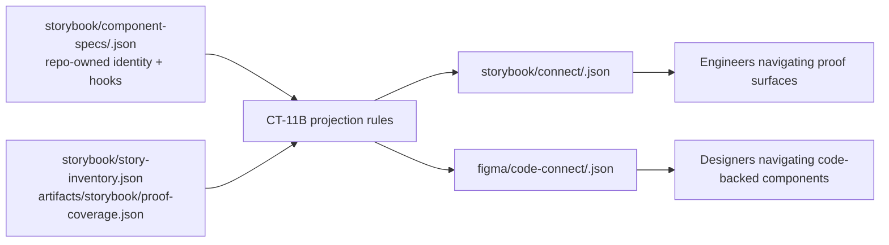
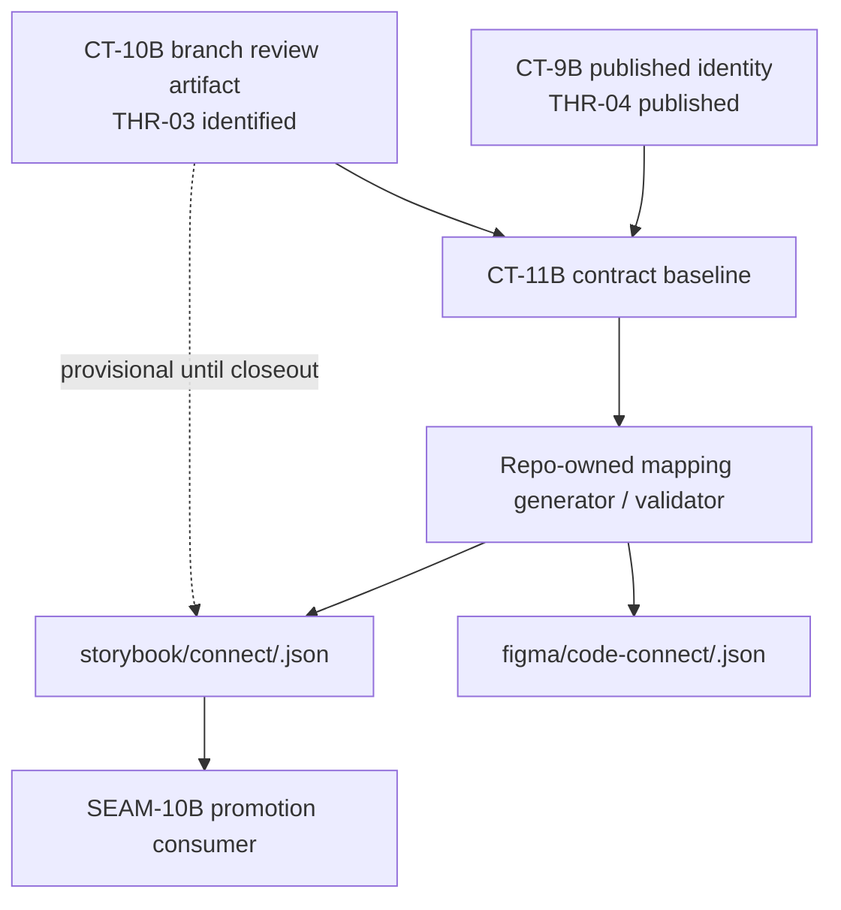
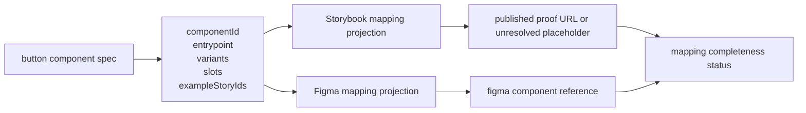

# Review Bundle - SEAM-9B Reusable Component Mapping and Link Convergence

This artifact feeds `gates.pre_exec.review`.
`../../review_surfaces.md` is pack orientation only.

## Falsification Questions

- Can the proposed mapping schema still let vendor-generated IDs, Figma metadata, or Chromatic URLs redefine component identity instead of projecting from `CT-9B`?
- Could a component appear fully mapped even when `codeEntrypoint`, `figmaComponentRef`, or published Storybook link data is missing or only locally inferred?
- If `SEAM-8B` lands a different `CT-10B` URL shape or review-mode rule, would this seam silently bake stale Storybook link semantics into `CT-11B`?

## R1 - Repo-Owned Mapping Projection Flow

## R2 - Storybook Link Resolution And Provisional Handoff

## R3 - Pilot Component Mapping Surface

## Likely Mismatch Hotspots

- `storybook/component-specs/button.json` currently leaves `codeEntrypoint` and `figmaComponentRef` as `null`, so the pilot identity basis exists but the mapping seam still has to decide which fields are required before a component may claim completeness.
- `THR-03` is not published yet, so any field that promises a current Storybook URL risks locking in stale semantics if it is treated as required before `SEAM-8B` lands.
- Storybook and Figma projections can drift if they each acquire separate normalization logic instead of sharing one repo-owned identity transform.
- The temptation to reuse vendor terminology directly in `CT-11B` can make downstream promotion parse tool-specific payloads instead of a stable repo-owned shape.

## Pre-Exec Findings

- `REM-003` remains open and is the primary contract-definition blocker for this seam: the repo still lacks a published repo-owned mapping and link contract for future Code Connect and Storybook Connect style rails.
- `THR-04` is already published and usable as current basis, but `THR-03` remains only `identified`; any execution plan that treats published Storybook links as current before `SEAM-8B` closeout would be a pre-exec mismatch.
- The current pilot basis is narrow and real: `storybook/component-specs/button.json`, `storybook/story-inventory.json`, and `artifacts/storybook/proof-coverage.json` already describe the reusable component identity and example-story side of the mapping problem, but they do not yet publish code entrypoint or Figma reference truth.
- No new remediation is opened yet beyond `REM-003`; if `SEAM-8B` lands a `CT-10B` schema that invalidates this seam's assumed link fields, pre-exec revalidation should open a new `origin_phase: pre_exec` remediation rather than silently editing around it.

## Pre-Exec Gate Disposition

- **Review gate**: pending
- **Contract gate concerns**: `CT-11B` must freeze repo-owned identity, required-versus-nullable mapping fields, and one shared projection boundary before implementation starts.
- **Revalidation prerequisites**: `SEAM-8B` must land `CT-10B`, publish `THR-03`, and record a realized seam-exit handoff in `../../governance/seam-8b-closeout.md`.
- **Opened remediations**: `REM-003` remains open; no additional pre-exec remediation is proposed yet.

## Planned Seam-Exit Gate Focus

- **What must be true before downstream promotion is legal**: `CT-11B` is published in repo-owned projection surfaces, required mapping fields are explicit, and Storybook link fields are either backed by published `CT-10B` reality or explicitly marked unavailable.
- **Which outbound contracts/threads matter most**: `CT-11B` and `THR-07`
- **Which review-surface deltas would force downstream revalidation**: any change to component identity shape, Figma reference conventions, Storybook URL resolution logic, or nullable-versus-required completeness rules.
